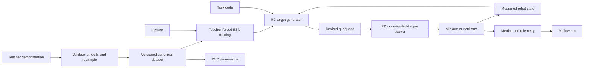

# Reservoir-Computing Robot-Arm Controller: Implementation Plan

**Status:** Initial implementation plan

**Last updated:** 2026-08-29

**Companion task ledger:** [TASKS.md](TASKS.md)

## 1. Objective

This project investigates reservoir-computing (RC) controllers for robot arms,
with the final goal of adaptive online learning inside a real-time control loop
on a physical CRANE-X7.

Development proceeds through increasingly demanding systems:

1. 2-DOF planar arm in dynamics simulation.
2. 4-DOF planar arm in dynamics simulation.
3. 7-DOF CRANE-X7 in rigid-body dynamics simulation with gravity.
4. Physical 7-DOF CRANE-X7.
5. Online adaptation in simulation and, after explicit safety qualification,
   on hardware.

The first implementation milestone is deliberately narrower: offline learning
from one demonstration of a 2-DOF, single-target reaching motion (task 1-a).
Later stages are gated by evidence from that milestone.

Scientific completion does not require the RC method to outperform every
baseline. A negative or inconclusive result is valid when the experiment is
fair, reproducible, and explains the observed limitation.

## 2. Research questions and hypotheses

### 2.1 Primary questions

1. Can an echo state network (ESN) learn a closed-loop joint target generator
   from demonstrated motion?
2. Does feedback through the measured robot state make the learned generator
   robust to initial-condition error or external disturbance?
3. Can one framework learn both equilibrium behavior (reaching) and limit-cycle
   behavior (periodic drawing)?
4. Can offline training be extended to bounded online adaptation within the
   timing and safety constraints of a physical robot?

### 2.2 Stage hypotheses

- **H1 — one demonstration:** From the demonstrated initial posture, an ESN can
  generate a reference whose tracked motion has bounded joint-space error and
  whose endpoint remains near the demonstrated target.
- **H2 — local robustness:** Training and augmentation can enlarge the basin of
  attraction around the demonstrated initial posture.
- **H3 — multiple demonstrations:** Demonstrations from multiple postures can
  produce a target-reaching policy that succeeds from unseen nearby postures.
- **H4 — task conditioning:** A task-conditioned ESN can switch among targets
  without training a separate reservoir for every target.
- **H5 — dynamical primitives:** The same state-conditioned architecture can
  represent both a stable equilibrium and stable periodic orbits.
- **H6 — sim-to-real:** The C++ implementation can reproduce the Python policy
  closely enough to run within `rtctrl`'s control deadline.
- **H7 — online adaptation:** A bounded online readout update can improve
  performance under controlled plant changes without violating safety limits.

These are hypotheses to test, not acceptance criteria for the software.

## 3. Project boundaries and dependencies

The repository owns the learning policy, research protocol, experiment
configuration, metrics, tuning, reproducibility, and adapters between the three
domain libraries. It must not duplicate their core responsibilities.

| Dependency | Responsibility used here | Integration |
| --- | --- | --- |
| [rclib](https://github.com/hrshtst/rclib) | ESN reservoirs; offline ridge and later online RLS/LMS readouts; Python and C++ APIs | `third_party/rclib` submodule |
| [skelarm](https://github.com/hrshtst/skelarm) | Configurable planar kinematics/dynamics, teaching logs, task/controller registries, disturbances, baselines, and deterministic replay | `third_party/skelarm` submodule |
| [rtctrl](https://github.com/hrshtst/rtctrl) | CRANE-X7 simulation/hardware bridge, computed-torque baseline, telemetry, motor limits, watchdogs, and hardware safety | `third_party/rtctrl` submodule |

All submodules are pinned to reviewed commits and initialized recursively.
Project code may adapt public APIs but must not copy library internals.

### 3.1 Licensing

Original source code and documentation in this repository are licensed under
`GPL-3.0-only`; see the root `LICENSE`. New source files carry
`SPDX-License-Identifier: GPL-3.0-only` headers. This choice matches `skelarm`,
which is GPL-3.0-only. Apache-2.0 code from `rclib` and `rtctrl` can be combined
into a GPLv3 work, but their copyrights, license texts, and notices remain in
force and are not relicensed by this project. See `THIRD_PARTY_NOTICES.md` and
the [Apache compatibility guidance](https://www.apache.org/licenses/GPL-compatibility).

Before redistributing a recursive checkout, release, binary, model, or asset
bundle, audit every direct and transitive dependency at its pinned revision.
In particular, CRANE-X7 descriptions and mesh assets used transitively by
`rtctrl` carry noncommercial and other asset-specific terms; GPLv3 does not
override them. Keep restricted assets out of distributable bundles unless their
terms have been reviewed and satisfied.

Software licensing does not automatically cover demonstrations, datasets,
trained models, plots, or media. Each data/artifact record declares its own
license and access classification; absence of that metadata means the artifact
is private and not redistributable.

If a generally useful capability is missing, implement a minimal local adapter
first when possible. If the capability belongs to a library, create a focused
branch and pull request in that library with tests, then advance this project's
submodule pin after the change is available at a stable commit.

Likely upstream work includes versioned `rclib` model serialization for Python
to C++ transfer. `skelarm` and `rtctrl` changes are justified only after their
existing extension interfaces have been shown insufficient.

## 4. System architecture



The ESN is a **target generator**, not the torque controller. It produces a
desired joint trajectory online from measured state. A separately qualified
low-level controller converts that desired trajectory to torque or physical
motor commands. This separation supports fair baselines and lets the same RC
policy concept move from `skelarm` to `rtctrl`.

## 5. Initial ESN control formulation

### 5.1 Signals

At sample `k`, define the robot feedback and optional task condition as

\[
  s_k = [q_k^\mathsf{T},\; \dot q_k^\mathsf{T}]^\mathsf{T},
  \qquad
  u_k = [\bar s_k^\mathsf{T},\; c_k^\mathsf{T}]^\mathsf{T},
\]

where `q` is joint position, `dq` is joint velocity, the bar denotes the model
recipe's input transform, and `c` is a task code. The transform centers every
channel on its training-set mean; its scales follow the policy the recipe
declares: the training-set standard deviations (`training_std`) or one shared
physical scale per channel (`fixed_scale`, e.g. 0.3 rad for `q` and 4 rad/s
for `dq`), which keeps a barely moving joint from amplifying tracking jitter
into the reservoir. The transform is derived from the dataset's stored
statistics (Section 7.3) and recorded in the recipe; the canonical dataset
itself is unchanged by the policy. Task 1-a has no task-code dimensions
because it contains one fixed target. Multi-target experiments append a
one-hot target identifier.

The initial readout target is the next desired joint position:

\[
  y_k = q^{\mathrm{demo}}_{k+1}.
\]

Absolute next-position prediction is the only supported output representation
in task 1-a. Predicting increments or torque is reserved for later ablations.

### 5.2 Reservoir and readout

For a leaky random sparse reservoir,

\[
  x_{k+1} = (1-a)x_k
  + a\tanh(W_{\mathrm{res}}x_k + W_{\mathrm{in}}[1;u_k]),
\]

\[
  \hat q^d_{k+1} = W_{\mathrm{out}}[1;x_{k+1}].
\]

`rclib` constructs the fixed reservoir, and its readout consumes the reservoir
state only, with its own bias term. An input pass-through readout
\(W_{\mathrm{out}}[1;x_{k+1};u_k]\) is a separately named future ablation
(`readout-input-passthrough`), not the primary formulation. Offline learning
fits only the readout using ridge regression:

\[
  W_{\mathrm{out}}
  = \arg\min_W \|Y-XW\|_F^2 + \lambda\|W\|_F^2.
\]

The implementation must follow `rclib`'s bias convention exactly rather than
manually adding a second readout bias.

### 5.3 Teacher forcing, priming, and dwell

Every canonical demonstration contains three contiguous intervals:

1. **Initial hold:** the teacher holds the initial posture. This supplies a
   deterministic reservoir washout/priming interval.
2. **Movement:** the demonstrated reaching motion.
3. **Final dwell:** the teacher holds the endpoint inside the target region so
   the ESN observes the desired equilibrium behavior.

During training, `u_k` is constructed from demonstrated state. Each episode
starts with a reset reservoir; the washout samples update the reservoir but do
not contribute to the ridge loss.

During evaluation, the low-level controller first holds the configured initial
posture while the reset ESN receives the measured state for the same priming
duration. The ESN then runs closed loop: its next input always contains actual
robot feedback, never its previously predicted state.

Episode boundaries may not be concatenated without an explicit reservoir reset.

### 5.4 Desired derivatives and low-level tracking

The target generator returns desired position at every control sample. A causal,
stateful derivative estimator computes desired velocity and acceleration using
backward differences followed by configurable low-pass filtering. It must:

- reset at episode start;
- emit zero desired velocity and acceleration on its first sample;
- use measured sample intervals and reject non-positive or excessive intervals;
- expose its raw and filtered values in telemetry;
- have one implementation contract shared by training evaluation and C++ parity
  tests.

Two low-level controller combinations are evaluated:

- RC target generator + joint-space PD;
- RC target generator + computed-torque control.

The initial vertical slice uses PD first. Computed torque is added only after the
PD data path and evaluation protocol pass their integration tests.

## 6. Fair baseline protocol

The baselines receive the demonstrated trajectory directly as their reference:

1. joint-space PD trajectory replay;
2. computed-torque trajectory replay.

Comparison is paired by low-level controller:

- RC+PD versus replay+PD;
- RC+computed torque versus replay+computed torque.

Controller gains are tuned on direct replay before ESN tuning, then frozen.
ESN tuning may not change the baseline gains. All paired methods use identical:

- robot model and integration step;
- initial condition and disturbance realization;
- joint, velocity, torque, and endpoint limits;
- demonstration preprocessing;
- run duration and metric definitions;
- development and confirmatory seed sets.

Tuning effort is recorded. Conclusions must distinguish differences caused by
the target generator from differences caused by the tracker.

## 7. Data contracts

### 7.1 Storage location and portability

Experimental payloads do not live in Git and are not stored in the repository
working tree. This includes raw demonstrations, processed datasets, full run
logs, trained models, MLflow state, and Optuna databases. The only exception is
small synthetic or sanitized data under `tests/fixtures/` required for automated
tests.

All tools resolve a machine-local storage root in this order:

1. `ARM_RC_CTRL_STORAGE_ROOT` environment variable;
2. `[storage].root` in
   `${XDG_CONFIG_HOME:-$HOME/.config}/arm-rc-ctrl/storage.toml`;
3. `/external/arm-rc-ctrl`.

The committed `configs/storage.example.toml` documents the machine-local format.
If the resolved root is absent, inaccessible, or not writable for an operation
that produces data, the command fails before running. It never falls back to the
repository. Versioned metadata contains logical `armrc://` URIs, never absolute
machine paths.

The external root uses this layout:

```text
<storage-root>/
├── raw/
├── processed/
├── runs/
├── models/
├── mlflow/
├── optuna/
├── dvc-cache/
└── dvc-store/
```

### 7.2 Artifact records and raw demonstrations

Git stores only `data/catalog.toml`, one small TOML record per artifact under
`data/records/{raw,processed,runs,models}/`, and DVC metafiles when applicable.
Every artifact record contains at least:

- schema version, immutable artifact ID, kind, and logical `armrc://` URI;
- SHA-256 digest, byte size, media format, and payload schema version;
- creation timestamp, license, access classification, and optional expiry;
- producing run/command, resolved-config digest, project/dependency revisions,
  and source artifact IDs;
- DVC target/hash when DVC manages the payload.

The native `*.sklog.npz` produced by `skelarm` is retained unchanged at
`armrc://raw/<artifact-id>/demo.sklog.npz`. Its record additionally contains the
robot/scenario configuration, sampling clock and units, pseudonymous teacher or
recording-session ID, task/target/initial posture, notes, and prime/move/dwell
interval boundaries.

Payload creation is transactional: write to an external temporary path,
validate it, compute its digest, atomically move it to the immutable final URI,
then write the repository record. Raw recordings are never overwritten. A
correction creates a new artifact ID and records the superseded ID. Readers
verify size and digest and fail on missing or mismatched data.

### 7.3 Canonical processed dataset

Each processed dataset payload is an external `samples.npz` referenced by a
Git-tracked artifact record. Arrays use `float64` and have a common leading
sample dimension:

| Array | Shape | Meaning |
| --- | --- | --- |
| `t` | `(N,)` | Monotonic time in seconds, beginning at zero |
| `q`, `dq`, `ddq` | `(N, dof)` | Demonstrated joint state |
| `tip`, `dtip`, `ddtip` | `(N, task_dim)` | Demonstrated endpoint state |
| `task_code` | `(N, task_code_dim)` | Empty for task 1-a; one-hot later |
| `phase` | `(N,)` | `prime`, `move`, or `dwell` encoded by documented integers |

The artifact record also contains source IDs, filters, resampling period,
derivative method, normalization statistics, array shapes/dtypes, and checksums.
Validation rejects NaN/Inf, non-monotonic time, unexpected shapes, joint-limit
violations, missing phase intervals, or inconsistent units.

Normalization statistics are fitted on training data only and persisted in the
model recipe. Near-zero scales are replaced by `1.0` and reported.

### 7.4 Run record

Full run records are written under `armrc://runs/<run-id>/`; Git retains only
their artifact records and deliberately curated small reports/plots. Every
simulation/evaluation run records at least:

- measured `t`, `q`, `dq`, and endpoint position;
- desired `q`, raw/filtered desired derivatives, and low-level tracking error;
- requested/applied torque when exposed by the backend;
- task code, target, disturbances, saturation, and termination reason;
- full resolved config, seeds, Git commit, dirty-tree flag, dependency commits,
  DVC hashes, Python lock hash, platform, and library versions.

A confirmatory run from a dirty worktree is rejected unless explicitly marked as
exploratory.

## 8. Public software interfaces

The exact module layout may evolve, but these behavior contracts remain stable.

```python
@dataclass(frozen=True)
class RobotState:
    t: float
    q: NDArray[np.float64]
    dq: NDArray[np.float64]


@dataclass(frozen=True)
class DesiredJointState:
    q: NDArray[np.float64]
    dq: NDArray[np.float64]
    ddq: NDArray[np.float64]


class TargetGenerator(Protocol):
    def reset(self, initial_state: RobotState) -> None: ...
    def step(
        self,
        state: RobotState,
        task_code: NDArray[np.float64] | None = None,
    ) -> DesiredJointState: ...
```

Additional required interfaces are:

- a typed dataset loader/validator that never silently repairs invalid input;
- an `RcTargetGenerator` adapter around `rclib.ESN`;
- a `skelarm.Controller` adapter that combines a target generator and low-level
  tracker while exposing internal log channels;
- pure metric functions returning typed values without writing files;
- experiment runners that accept a resolved config and return a run record;
- CLI commands that are thin wrappers around tested library functions.

Configuration uses TOML and is validated before creating a simulator or study.
Unknown keys are errors. Paths are resolved relative to the config file, and the
fully resolved config is stored with every run.

The initial model artifact is a deterministic **model recipe**, not a Python
pickle. It contains the ESN hyperparameters and seeds, preprocessing and
normalization settings, dataset identity/hash, `rclib` revision, and readout
configuration. Loading the recipe reconstructs and refits the model. Before C++
deployment, replace this with versioned fitted-model serialization implemented
in `rclib`; cross-language load and prediction parity are a phase gate.

## 9. Metrics and evaluation

### 9.1 Task 1-a metrics

For `N` aligned movement samples and `d` joints, the primary metric is joint
trajectory RMSE:

\[
  \mathrm{RMSE}_q =
  \sqrt{\frac{1}{Nd}\sum_{k=1}^{N}\|\operatorname{wrap}(q_k-q_k^{demo})\|_2^2}.
\]

Report per-joint RMSE as well as the aggregate. Angular differences use the
project's joint-angle convention; wrapping is applied only to continuous joints.

During the final dwell window report:

- endpoint error mean, RMS, maximum, and 95th percentile;
- fraction of samples inside the target tolerance;
- longest continuous in-tolerance duration;
- joint velocity RMS and maximum;
- torque RMS, peak, saturation fraction, and control effort
  `integral(sum(tau**2), t)`;
- success/failure and a structured termination reason.

Trajectory metrics compare the fixed-duration demonstrated motion. No dynamic
time warping is used for the primary result because it can hide timing error. It
may be reported as a labeled diagnostic only.

### 9.2 Robustness protocol

Evaluate in this order:

1. exact demonstrated initial posture with no disturbance;
2. small joint-space initial-posture perturbations;
3. larger held-out perturbations;
4. repeatable finite-duration endpoint force pulses during motion;
5. combined posture and force perturbations.

Perturbation grids, force timing, directions, magnitudes, and random seeds are
versioned configuration. A pilot using the frozen direct-replay baseline selects
nontrivial but safe levels. After the confirmatory suite is declared, those
values and seeds are locked and may not be used for tuning. The scenarios are
a pure function of a protocol's levels and seeds (stable IDs; random posture
directions from an independent seeded stream per class), so every method runs
identical scenarios; the suite persists every run, keeps failures in the
per-class aggregation, and takes paired RC-minus-replay effects over the
scenarios where both runs of a pair succeeded, reporting the failed pairs next
to them. Development levels and seeds (`configs/evaluations/*_robustness_dev_*.toml`)
exercise the suite on a frozen recipe before the one-shot confirmatory run.

### 9.3 Later-task metrics

- **Task 1-b:** endpoint target-region dwell success, final error, settling time,
  path length/efficiency, effort, and success from unseen initial postures.
- **Multiple targets:** the same measures per target plus switch settling time,
  peak/RMS acceleration, integrated squared jerk, and discontinuity at switching.
- **Periodic curves:** phase-aligned endpoint RMSE, nearest-curve geometric RMS
  and Hausdorff-like 95th-percentile error, lap-period drift, closure error, and
  recovery time after perturbation.

## 10. Hyperparameter tuning

[Optuna](https://optuna.org/) manages algorithmic ESN tuning. The versioned
search protocol (`configs/studies/esn_search_*.toml`) bounds reservoir size,
spectral radius, sparsity, leak rate, input scaling, reservoir seed, ridge
regularization, and the derivative-filter cutoffs of the causal estimator; the
washout is the demonstration's prime phase (a recipe invariant, section 5.1)
rather than a tuned duration, and the input transform stays the pilot-selected
recipe value. Labelled comparison points (the development anchor at the M2
ridge value 1e-2 and at 3e-2, 1e-1, 3e-1) are evaluated before sampling.
Low-level tracker gains are excluded from ESN studies after baseline
qualification.

Task 1-a uses a seeded sampler and pruner. The objective is median movement
joint RMSE across development scenarios. A trial is infeasible and receives a
documented penalty if it diverges, violates configured state/torque limits,
terminates early, fails the configured final-dwell constraint, exceeds the
protocol's saturation bound, or cannot be trained. Scenarios are evaluated in
protocol order and stop at the first infeasible one (the objective is already
decided); the running objective is reported to the pruner after every
feasible scenario. All objective components — per-scenario termination,
movement RMSE, dwell criteria, saturation, boundary jump, and the reason —
are logged separately; the scalar objective is never the only saved result.
Only trials feasible in every development scenario are eligible for selection
and freezing — a study without one selects nothing — and, because Optuna counts
queued comparison points towards the sampler's start-up trials, a protocol
states its start-up count inclusive of them.

Development/tuning scenarios and seeds are separate from confirmatory scenarios
and seeds. The selected recipe is frozen before confirmatory evaluation. Reusing
confirmatory outcomes to alter hyperparameters creates a new study/version and
invalidates the earlier confirmatory label.

Alternative candidates considered:

- Ray Tune is useful for distributed workloads but unnecessary initially.
- Hydra can compose large configuration trees, but typed TOML keeps the initial
  stack aligned with `skelarm` and `rtctrl`.
- Weights & Biases provides hosted tracking, but local MLflow avoids requiring a
  third-party account and keeps research data local by default.

## 11. Experiment and data management

- **MLflow:** use a local store under `armrc://mlflow/` (a SQLite tracking
  database plus an artifact directory; MLflow's plain file store is in
  maintenance mode). Every curated run command logs there by default (the
  `--no-mlflow` opt-out is for scratch only): resolved parameters, dependency
  revisions and build identities, payload digests, seeds, scalar metrics,
  plots, reports, model recipes, provenance, and Optuna study summaries. A
  study is mirrored as one parent run (protocol, digest, dataset and tracker
  identities, provenance, summary, selection) with one child run per trial
  (point, objective, every component as its own metric, the running objective
  as a series, the reason, the full evaluation as an artifact), idempotent per
  trial across resumes. The Git pointer record and run directory stay
  authoritative; a tracking server remains optional.
- **DVC:** Git stores only `.dvc` metafiles plus the domain artifact records.
  Configure the cache and default local remote per machine in ignored
  `.dvc/config.local`, resolving them to `<storage-root>/dvc-cache` and
  `<storage-root>/dvc-store`. Use `dvc add --to-remote` for large inputs when it
  avoids a repository-local copy. Never commit a machine-specific absolute path.
- **Optuna:** place local SQLite studies under `armrc://optuna/` (one database
  per study). A study records its identity (protocol digest, seeded sampler,
  pruner, direction) as user attributes and resumes only when that identity
  matches; a failing trial aborts the study instead of being recorded as a
  failure. Export selected trials and study summaries to MLflow so the
  database is not the sole record.
- **Git/uv:** Git pins project/submodule revisions; `uv.lock` pins Python
  dependencies. CMake/submodules pin the C++ build inputs.

Generated payloads, temporary captures, materialized DVC data, and local storage
configuration are ignored by Git. Only artifact records, the catalog, DVC
metafiles, curated small reports/plots/tables, recipes, and documentation are
committed. Removing a Git pointer never deletes an external payload; garbage
collection is a separate, explicit, audited operation.

## 12. Proposed repository layout

```text
arm-rc-ctrl/
├── cpp/
│   ├── CMakeLists.txt
│   ├── apps/
│   ├── include/arm_rc_ctrl/
│   ├── src/
│   └── tests/
├── configs/
│   ├── controllers/
│   ├── evaluations/
│   ├── robots/
│   ├── storage.example.toml
│   ├── studies/
│   └── tasks/
├── data/
│   ├── catalog.toml
│   └── records/
│       ├── models/
│       ├── processed/
│       ├── raw/
│       └── runs/
├── docs/
│   ├── PLAN.md
│   ├── TASKS.md
│   ├── experiments/
│   └── theory/
├── scripts/
│   ├── evaluate.py
│   ├── preprocess_demo.py
│   ├── record_demo.py
│   ├── reproduce_1a.py
│   ├── train.py
│   └── tune.py
├── src/arm_rc_ctrl/
│   ├── adapters/
│   ├── config/
│   ├── controllers/
│   ├── data/
│   ├── experiments/
│   ├── metrics/
│   └── rc/
├── tests/
│   ├── integration/
│   ├── regression/
│   └── unit/
├── third_party/
│   ├── rclib/
│   ├── rtctrl/
│   └── skelarm/
├── dvc.yaml
├── pyproject.toml
└── uv.lock
```

`scripts/` contains thin entry points, not business logic. Experiment code lives
under `src/arm_rc_ctrl`. C++ is introduced only when the Python 2-DOF milestone
passes its reproducibility gate. The external payload tree described in Section
7.1 is intentionally outside this repository.

## 13. Phased implementation and gates

### Phase 0 — foundation

Create project metadata, recursive submodules, development tooling, CI, typed
configuration, machine-local storage resolution, and a headless deterministic
smoke test.

**Gate:** A clean recursive checkout can install, lint, type-check, and test both
the Python vertical slice and a minimal CMake target using documented commands.

### Phase 1 — data and direct-replay baselines

Implement demonstration validation/preprocessing and qualify PD and
computed-torque replay in `skelarm`. Freeze their configs and lock metric
definitions before training an ESN.

**Gate:** An externally stored raw demonstration can be resolved from its
Git-tracked record, converted reproducibly into a canonical external dataset,
replayed by both baselines, and regenerated with identical shapes, checksums,
and metrics within declared numerical tolerances.

### Phase 2 — task 1-a RC vertical slice

Implement teacher-forced training, reset/priming, closed-loop target generation,
desired derivative estimation, PD tracking, telemetry, and nominal evaluation.
Then add computed-torque tracking.

**Gate:** Unit and integration tests cover the entire data flow, the nominal run
completes without invalid state or limit violations, and every result contains
complete provenance. RC performance need not beat the baseline.

### Phase 3 — tuning and robustness

Add Optuna studies, frozen model selection, perturbation/force suites, MLflow
reporting, and the one-command task 1-a reproduction workflow.

**Gate:** A fresh checkout plus a configured external store can resolve all DVC
and artifact records and reproduce the selected model and confirmatory report
without consulting an untracked notebook or manual step.

### Phase 4 — broader planar tasks

Proceed through task 1-b, multiple targets, periodic curves, and 4-DOF scaling.
Each new task first defines its hypothesis, metric, data split, baseline, and
failure criteria, then receives implementation tasks in `TASKS.md`.

**Gate:** Each experiment has a frozen confirmatory protocol and a report that
compares paired baselines across seeds and perturbations.

### Phase 5 — C++ and 7-DOF simulation

Add fitted-model serialization to `rclib`, C++ inference, Python/C++ parity
fixtures, an `rtctrl::arm::Controller` adapter, real-time timing tests, and
CRANE-X7 simulation experiments under gravity.

**Gate:** C++ predictions match Python within declared tolerances; inference and
the complete control update meet the `rtctrl` deadline with measured margin; all
commands remain within configured limits; `rtctrl` simulation acceptance passes.

### Phase 6 — physical CRANE-X7 offline learning

Record supervised demonstrations, validate sim-to-real configuration, rehearse
with emulator/simulation, and execute short staged hardware trials.

**Gate:** An independent safety review signs off the exact executable, config,
model hash, limits, abort behavior, and bring-up checklist before motion.

### Phase 7 — online learning

Define the adaptation task and safety envelope from offline evidence. Compare
RLS and LMS readouts first in deterministic simulation, then in 7-DOF simulation,
and only then consider hardware. Online updates require bounded weights/outputs,
change monitoring, rollback/freeze behavior, and a non-learning safety layer.

**Gate:** The update law remains stable in stress tests, fits the cycle deadline,
can be frozen or rolled back immediately, and passes a new hardware safety review.

## 14. Testing strategy

Development follows TDD. Tests are added before or with the behavior they cover.

### Unit tests

- dataset schemas, units, shapes, interval detection, and invalid inputs;
- smoothing/resampling and derivative estimation on analytic signals;
- normalization and inverse transformation;
- ESN input/target alignment, reset, washout, and episode isolation;
- metric definitions, angle handling, and failure penalties;
- config defaults, rejection of unknown keys, and path resolution;
- provenance collection and clean/dirty-worktree policy.

### Property and regression tests

- resampling preserves constant/linear signals within tolerance;
- metrics are zero for identical signals and nonnegative otherwise;
- fixed seeds reproduce the same reservoir recipe and predictions within the
  declared platform tolerance;
- a tiny committed fixture protects sample alignment and Python/C++ parity;
- no test relies on a GUI, network service, or robot by default.

### Integration tests

- raw `skelarm` fixture to processed dataset;
- processed demonstration to direct-replay baseline run;
- teacher-forced ESN fit to closed-loop `skelarm` run;
- MLflow run contains mandatory provenance and artifacts;
- a small Optuna study resumes and selects a valid trial;
- DVC reproduction rebuilds expected outputs;
- later, C++ controller through `rtctrl::arm::SimArm` and the emulator.

### Manual and hardware tests

Manual reproduction scripts generate key tables and plots. Hardware tests are
never CI jobs. They require a human operator, staged duration/limits, an
independent power cutoff, and explicit recording of deviations from the approved
procedure.

## 15. Development and review workflow

1. Select the next unblocked task from [TASKS.md](TASKS.md) and mark it
   `IN PROGRESS` before implementation.
2. Add or update a failing test/specification.
3. Implement the smallest coherent behavior that passes it.
4. Run focused tests, then the repository quality gate.
5. Update human documentation after behavior stabilizes. If documentation and
   tested implementation disagree, immediately align documentation to the tested
   behavior or fix the implementation and tests when the behavior is wrong.
6. Update task status and evidence in the same commit.
7. Commit one task or a small cohesive group. Include task IDs in the commit
   message/body. Do not combine formatting, refactoring, and behavior changes
   unless inseparable.
8. At each phase gate, request review with the exact commands, configs, artifacts,
   known limitations, and unresolved research questions.

For upstream work:

1. Reproduce the missing generic capability in the owning library.
2. Create a dedicated branch in that library.
3. Add library-level tests and documentation.
4. Open a focused PR that discloses AI assistance when required by that project.
5. Keep this project compatible with the pinned revision until the PR is ready.
6. Advance the submodule in a separate integration commit and rerun this
   project's full relevant test suite.

## 16. Reproducibility requirements

A key result is reproducible only when another human can obtain it from:

- the project Git commit and clean/dirty state;
- exact `rclib`, `skelarm`, and `rtctrl` commits;
- `uv.lock`, compiler/CMake information, and platform metadata;
- resolved experiment config;
- logical artifact URIs, artifact-record revisions, payload SHA-256 digests, and
  DVC hashes where applicable;
- all random seeds and study/trial identifiers;
- one documented command or reproduction script;
- raw metrics in machine-readable form, not only a plot.

The reproduction script must fail clearly when storage configuration, required
payloads, data records, submodules, or versions are missing or mismatched. It
must not fall back to the repository, silently download mutable data, accept a
checksum mismatch, or select the latest model.

## 17. Safety principles

- Learning code never bypasses backend position, velocity, effort, current, or
  watchdog limits.
- Validate output shape, finiteness, timestamp freshness, and bounds before every
  command.
- On invalid ESN output, stale state, missed deadline, or internal exception,
  invoke the backend's documented safe abort/deactivation path; do not continue
  with newly generated commands.
- Simulation and wire/emulator tests precede hardware for every controller or
  safety-relevant change.
- `rtctrl` remains the authority for physical activation, watchdogs, command
  windows, and motor communication.
- Hardware operation is supervised and retains an independent actuator-power
  cutoff. Software deactivation is not treated as an emergency stop.
- Online learning never controls the safety envelope and can be frozen or
  bypassed without disabling the low-level safety controller.

## 18. Assumptions and deferred decisions

- Python 3.12+, `uv`, NumPy `float64`, TOML, pytest, Ruff, and a strict type
  checker form the initial Python stack.
- C++17, CMake, and Catch2 align with the current C++ dependencies.
- Large data and experiment state live below a per-machine external storage root,
  defaulting to `/external/arm-rc-ctrl`; Git stores portable records and DVC
  metafiles only. No cloud account is required.
- The initial task uses a horizontal, gravity-free `skelarm` model and controls
  arm joints only; the CRANE-X7 gripper is excluded until a task requires it.
- Original project code and documentation are GPL-3.0-only. Third-party and
  data/artifact terms remain separately applicable and must be inventoried.
- Exact online-learning tasks, weight bounds, rollback policy, and hardware
  admission criteria remain deferred until offline results exist. Before Phase 7
  starts, replace that epic with a separately reviewed, decision-complete plan.
