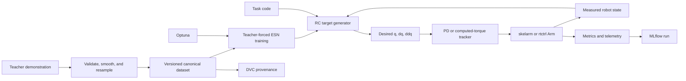

<!-- Copyright (c) 2026 Hiroshi Atsuta -->
<!-- SPDX-License-Identifier: GPL-3.0-only -->

# Architecture reference

[Roadmap](../PLAN.md) · [Work queue](../TASKS.md)

Detailed sections moved from the roadmap on 2026-09-22. Original section
numbers and historical implementation notes are retained so source-code
and configuration references remain interpretable. Current priorities and
gate status are in the roadmap/queue; experiment-specific decisions live
in each linked experiment plan. Read only the sections relevant to the task.

## 1. Objective

This project investigates reservoir-computing (RC) controllers for robot arms,
with the final goal of adaptive online learning inside a real-time control loop
on a physical CRANE-X7.

Development proceeds through increasingly demanding systems:

1. 2-DOF planar arm in dynamics simulation.
2. 4-DOF planar arm in dynamics simulation.
3. 7-DOF CRANE-X7 in rigid-body dynamics simulation with gravity.
4. Physical 7-DOF CRANE-X7.
5. Online adaptation in simulation and, after explicit safety qualification,
   on hardware.

The first completed research milestone was deliberately narrower: offline
learning from one demonstration of a 2-DOF, single-target reaching motion
(task 1-a). The completed `task_1a_recovery_v1` experiment tested whether
state-conditioned augmentation reduces the initial command gap while preserving
target convergence; its accepted negative result selected no recovery model.
The completed `task_1a_repetition_v1` pilot isolated episode-count and
ridge-scaling effects using exact repeated demonstrations and paired absolute
and residual readouts; M3REP-GATE records its closure on 2026-09-10. The next
approved experiment, `task_1a_manual_v1`, compares one versus ten manually
recorded reaches from the same fixed posture to the same target, with exact
copies and contractive synthetic episodes as controls. The owner approved its
plan and roadmap/task registration on 2026-09-15. Later stages are gated by
evidence from these milestones.

Scientific completion does not require the RC method to outperform every
baseline. A negative or inconclusive result is valid when the experiment is
fair, reproducible, and explains the observed limitation.

## 2. Research questions and hypotheses

### 2.1 Primary questions

1. Can an echo state network (ESN) learn a closed-loop joint target generator
   from demonstrated motion?
2. Does feedback through the measured robot state make the learned generator
   robust to initial-condition error or external disturbance?
3. Can one framework learn both equilibrium behavior (reaching) and limit-cycle
   behavior (periodic drawing)?
4. Can offline training be extended to bounded online adaptation within the
   timing and safety constraints of a physical robot?

### 2.2 Stage hypotheses

- **H1 — one demonstration:** From the demonstrated initial posture, an ESN can
  generate a reference whose tracked motion has bounded joint-space error and
  whose endpoint remains near the demonstrated target.
- **H2 — local robustness:** Training with smooth state-conditioned augmentation
  can reduce the initial command gap after a posture perturbation and enlarge the
  basin of attraction around the demonstrated initial posture while preserving
  convergence to the common target. The approved protocol is
  [`experiments/task_1a_state_conditioned_recovery/plan.md`](../experiments/task_1a_state_conditioned_recovery/plan.md).
- **H3 — multiple demonstrations:** Demonstrations from multiple postures can
  produce a target-reaching policy that succeeds from unseen nearby postures.
- **H4 — task conditioning:** A task-conditioned ESN can switch among targets
  without training a separate reservoir for every target.
- **H5 — dynamical primitives:** The same state-conditioned architecture can
  represent both a stable equilibrium and stable periodic orbits.
- **H6 — sim-to-real:** The C++ implementation can reproduce the Python policy
  closely enough to run within `rtctrl`'s control deadline.
- **H7 — online adaptation:** A bounded online readout update can improve
  performance under controlled plant changes without violating safety limits.

These are hypotheses to test, not acceptance criteria for the software.

## 3. Project boundaries and dependencies

The repository owns the learning policy, research protocol, experiment
configuration, metrics, tuning, reproducibility, and adapters between the three
domain libraries. It must not duplicate their core responsibilities.

| Dependency | Responsibility used here | Integration |
| --- | --- | --- |
| [rclib](https://github.com/hrshtst/rclib) | ESN reservoirs; offline ridge and later online RLS/LMS readouts; Python and C++ APIs | `third_party/rclib` submodule |
| [skelarm](https://github.com/hrshtst/skelarm) | Configurable planar kinematics/dynamics, teaching logs, task/controller registries, disturbances, baselines, and deterministic replay | `third_party/skelarm` submodule |
| [rtctrl](https://github.com/hrshtst/rtctrl) | CRANE-X7 simulation/hardware bridge, computed-torque baseline, telemetry, motor limits, watchdogs, and hardware safety | `third_party/rtctrl` submodule |

All submodules are pinned to reviewed commits and initialized recursively.
Project code may adapt public APIs but must not copy library internals.

### 3.1 Licensing

Original source code and documentation in this repository are licensed under
`GPL-3.0-only`; see the root `LICENSE`. New source files carry
`SPDX-License-Identifier: GPL-3.0-only` headers. This choice matches `skelarm`,
which is GPL-3.0-only. Apache-2.0 code from `rclib` and `rtctrl` can be combined
into a GPLv3 work, but their copyrights, license texts, and notices remain in
force and are not relicensed by this project. See `THIRD_PARTY_NOTICES.md` and
the [Apache compatibility guidance](https://www.apache.org/licenses/GPL-compatibility).

Before redistributing a recursive checkout, release, binary, model, or asset
bundle, audit every direct and transitive dependency at its pinned revision.
In particular, CRANE-X7 descriptions and mesh assets used transitively by
`rtctrl` carry noncommercial and other asset-specific terms; GPLv3 does not
override them. Keep restricted assets out of distributable bundles unless their
terms have been reviewed and satisfied.

Software licensing does not automatically cover demonstrations, datasets,
trained models, plots, or media. Each data/artifact record declares its own
license and access classification; absence of that metadata means the artifact
is private and not redistributable.

If a generally useful capability is missing, implement a minimal local adapter
first when possible. If the capability belongs to a library, create a focused
branch and pull request in that library with tests, then advance this project's
submodule pin after the change is available at a stable commit.

Likely upstream work includes versioned `rclib` model serialization for Python
to C++ transfer. `skelarm` and `rtctrl` changes are justified only after their
existing extension interfaces have been shown insufficient.

## 4. System architecture



The ESN is a **target generator**, not the torque controller. It produces a
desired joint trajectory online from measured state. A separately qualified
low-level controller converts that desired trajectory to torque or physical
motor commands. This separation supports fair baselines and lets the same RC
policy concept move from `skelarm` to `rtctrl`.

## 8. Public software interfaces

The exact module layout may evolve, but these behavior contracts remain stable.

```python
@dataclass(frozen=True)
class RobotState:
    t: float
    q: NDArray[np.float64]
    dq: NDArray[np.float64]


@dataclass(frozen=True)
class DesiredJointState:
    q: NDArray[np.float64]
    dq: NDArray[np.float64]
    ddq: NDArray[np.float64]


class TargetGenerator(Protocol):
    def reset(self, initial_state: RobotState) -> None: ...
    def step(
        self,
        state: RobotState,
        task_code: NDArray[np.float64] | None = None,
    ) -> DesiredJointState: ...
```

Additional required interfaces are:

- a typed dataset loader/validator that never silently repairs invalid input;
- an `RcTargetGenerator` adapter around `rclib.ESN`;
- a `skelarm.Controller` adapter that combines a target generator and low-level
  tracker while exposing internal log channels;
- pure metric functions returning typed values without writing files;
- experiment runners that accept a resolved config and return a run record;
- CLI commands that are thin wrappers around tested library functions.

Configuration uses TOML and is validated before creating a simulator or study.
Unknown keys are errors. Paths are resolved relative to the config file, and the
fully resolved config is stored with every run.

The initial model artifact is a deterministic **model recipe**, not a Python
pickle. It contains the ESN hyperparameters and seeds, preprocessing and
normalization settings, dataset identity/hash, `rclib` revision, and readout
configuration. Loading the recipe reconstructs and refits the model. Before C++
deployment, replace this with versioned fitted-model serialization implemented
in `rclib`; cross-language load and prediction parity are a phase gate.

## 12. Proposed repository layout

```text
arm-rc-ctrl/
├── cpp/
│   ├── CMakeLists.txt
│   ├── apps/
│   ├── include/arm_rc_ctrl/
│   ├── src/
│   └── tests/
├── configs/
│   ├── controllers/
│   ├── evaluations/
│   ├── robots/
│   ├── storage.example.toml
│   ├── studies/
│   └── tasks/
├── data/
│   ├── catalog.toml
│   └── records/
│       ├── models/
│       ├── processed/
│       ├── raw/
│       └── runs/
├── docs/
│   ├── PLAN.md
│   ├── TASKS.md
│   ├── experiments/
│   └── theory/
├── scripts/
│   ├── evaluate.py
│   ├── export_run_sklog.py
│   ├── play_run.py
│   ├── plot_task_1a_trajectories.py
│   ├── preprocess_demo.py
│   ├── record_demo.py
│   ├── reproduce_1a.py
│   ├── train.py
│   └── tune.py
├── src/arm_rc_ctrl/
│   ├── adapters/
│   ├── config/
│   ├── controllers/
│   ├── data/
│   ├── experiments/
│   │   └── playback.py
│   ├── metrics/
│   └── rc/
├── tests/
│   ├── integration/
│   ├── regression/
│   └── unit/
├── third_party/
│   ├── rclib/
│   ├── rtctrl/
│   └── skelarm/
├── dvc.yaml
├── pyproject.toml
└── uv.lock
```

`scripts/` contains thin entry points, not business logic. Experiment code lives
under `src/arm_rc_ctrl`. C++ is introduced only when the Python 2-DOF milestone
passes its reproducibility gate. The external payload tree described in Section
7.1 is intentionally outside this repository.
