# Task 1-a: learning a reaching motion with reservoir computing

This report explains the first complete experiment in the project for readers
who do not need the full trial ledger. The detailed tables and machine-readable
evidence remain in [report.md](report.md).

> **Result in one sentence:** an offline-trained reservoir-computing controller
> reached and held the target successfully in all 65 locked confirmatory
> scenarios under both low-level trackers, but direct trajectory replay remained
> substantially more precise when no external force was present.

## Background and motivation

The long-term objective is an adaptive controller that can learn robot motion
quickly enough for eventual online use. Reservoir computing (RC), implemented
here as an echo state network (ESN), is attractive because its recurrent
reservoir is fixed: training only estimates a linear readout. This makes fitting
and inference inexpensive compared with training every recurrent weight.

Before attempting online adaptation or a physical seven-axis arm, the project
uses a staged question: can one ESN learn a demonstrated motion, run causally in
closed loop from measured robot state, and remain safe under controlled
perturbations? Task 1-a is that first end-to-end test. It is a proof of the
learning and evaluation framework, not yet a demonstration of online learning.

The frozen model learned from exactly **one five-second trajectory (501
samples)**. No random-noise injection, perturbed copies, or other data
augmentation was used during training. That is encouraging evidence of training
data efficiency, especially when contrasted qualitatively with modern deep
reinforcement learning workflows that commonly collect many repeated
environment interactions. It is not a controlled RC-versus-Deep-RL benchmark:
this task is simple, no Deep RL agent was trained, and model selection still
used many development simulations.

## Task specification

| Item | Specification |
| --- | --- |
| Robot | Gravity-free planar arm, 2 revolute joints, 0.30 m and 0.25 m links |
| Sampling | 100 Hz (`dt = 0.01 s`), 501 samples over 5 s |
| Initial posture | `(0.2, 1.2)` rad |
| Target | End effector at `(0.10, 0.45)` m |
| Target tolerance | 0.01 m |
| Timing | Hold 0–1 s, reach 1–4 s, dwell 4–5 s |
| Demonstration | Scripted minimum-jerk reach tracked by computed torque |

The robot succeeds when it completes safely, spends at least 90% of the dwell
window inside the 1 cm target region, and keeps every dwell joint speed at or
below 0.05 rad/s. Joint, velocity, torque, and endpoint limits apply throughout.

## Approach

The ESN is trained by teacher forcing on one processed demonstration. At sample
`k`, its input is the demonstrated joint position and velocity `[q_k, dq_k]`;
the target is the next demonstrated joint position `q_(k+1)`. The initial hold
also washes out the reservoir state. Ridge regression fits the readout while the
random reservoir remains fixed.

The one trajectory supplies 500 next-step input/target pairs. The first 100
pairs wash out the reservoir, leaving 400 rows in the ridge-regression loss.
Preprocessing derives velocities, phases, and fixed physical input scaling from
that record; it does not create additional trajectories or add noise.

During evaluation the input comes only from measured feedback:

```text
measured q, dq -> fixed ESN reservoir -> desired q
                                      -> causal desired dq, ddq
                                      -> PD or computed-torque tracker
                                      -> torque-limited simulated robot
                                      -> measured q, dq (feedback)
```

The selected model has 250 reservoir neurons. It was chosen from a seeded
1,000-trial Optuna study: 902 trials were feasible, and the selected region was
checked with 24 additional trial/seed combinations, all feasible. Hyperparameter
tuning used development scenarios that were disjoint from the final
confirmatory seeds and perturbations.

## Baselines and fair comparison

The conventional baseline receives the demonstrated joint trajectory directly
instead of generating it with the ESN. The comparison is paired by tracker:

| Learned arm | Matched baseline | What the difference isolates |
| --- | --- | --- |
| RC target generator + PD v2 | Demonstration replay + PD v2 | Target-generator effect under PD |
| RC target generator + computed torque | Demonstration replay + computed torque | Target-generator effect under model-based tracking |

Tracker gains were tuned on direct replay and frozen before ESN tuning. Each
pair uses the same initial condition, disturbance, robot, limits, time step, and
metric definitions. Computed torque is a secondary comparison because ESN model
selection used PD v2.

## Robustness evaluation

The confirmatory protocol was locked before it was run. It contains 65 scenarios
per arm and four arms, for 260 evaluations total:

| Class | Cases per arm | Perturbation |
| --- | ---: | --- |
| Nominal | 1 | Demonstrated initial posture, no force |
| Small posture | 20 | Random joint offset with norm 0.05 rad |
| Large posture | 20 | Random joint offset with norm 0.10 rad |
| Force | 4 | 12 N endpoint pulse for 0.2 s at `t = 2 s`, four directions |
| Combined | 20 | Small posture offset plus the matched 12 N pulse |

The primary metric is joint-space RMSE against the demonstration during the
movement window. Failed runs remain in the aggregate rather than disappearing
from the statistics.

## Key results

All **260 of 260 runs succeeded**. Median movement-window joint RMSE is shown
below; lower is better.

| Method | Nominal | Small posture | Large posture | Force | Combined |
| --- | ---: | ---: | ---: | ---: | ---: |
| RC + PD v2 | 0.00260 | 0.00472 | 0.00852 | 0.01583 | 0.01667 |
| Replay + PD v2 | 0.000254 | 0.000254 | 0.000254 | 0.01561 | 0.01561 |
| RC + computed torque | 0.00262 | 0.00439 | 0.00926 | 0.06898 | 0.06995 |
| Replay + computed torque | 0.0000148 | 0.0000252 | 0.0000352 | 0.06898 | 0.06898 |


The logarithmic plot shows two effects. First, direct replay is much more
precise in nominal and posture-only cases. Second, the 12 N pulse dominates the
error under computed torque for both RC and replay, so that force response is a
tracker effect rather than an ESN effect.


Under PD v2, the median RC penalty grows from about 0.0023 rad nominally to
0.0083 rad for the large posture offsets. Under force and combined conditions,
the paired gap is below 0.001 rad because both methods experience nearly the
same disturbance-driven error. Saturation stayed at or below 0.4%, and every
successful RC run spent the full measured dwell window inside the target.

The tuning study changed the picture from a fragile initial search (one feasible
trial) to a broad feasible set (902 of 1,000 trials):


## Representative scenarios: animations and joint trajectories

The purple marker and ring show the target and its 1 cm tolerance. Green joints
show the recorded robot state. A red arrow appears during endpoint-force pulses.
The GIFs are sampled at 12 frames/s for presentation; metrics use the original
100 Hz logs.

For each robustness class, the displayed scenario is selected deterministically:
the RC+PD v2 run whose movement RMSE is closest to that class's RC+PD median.
The same scenario is then used for all four arms. This avoids choosing unusually
good or bad examples. In every 2-by-2 animation grid, learned RC is on the left,
direct replay is on the right, PD is the top row, and computed torque is the
bottom row.

The time-series plots show the teacher signal/direct-replay reference as a black
dashed line, replay's measured motion in blue, and RC's measured motion in
orange. They are split by tracker and then by joint; vertical dotted lines mark
the hold/reach and reach/dwell boundaries.

### Nominal

Scenario `nominal`: demonstrated posture and no external force.

| RC + PD v2 | Replay + PD v2 |
| --- | --- |
|  |  |
| RC+PD v2, `run-20260831-8dc3862d7168` | Replay+PD v2, `run-20260831-013f6eb247ff` |
| RC + computed torque | Replay + computed torque |
|  |  |
| RC+computed torque, `run-20260831-4f4f4934ec19` | Replay+computed torque, `run-20260831-8c0569ef8a62` |

| PD v2 joint trajectories | Computed-torque joint trajectories |
| --- | --- |
| 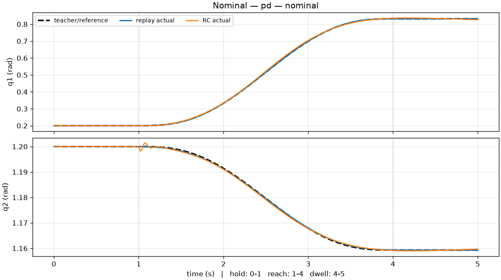 | 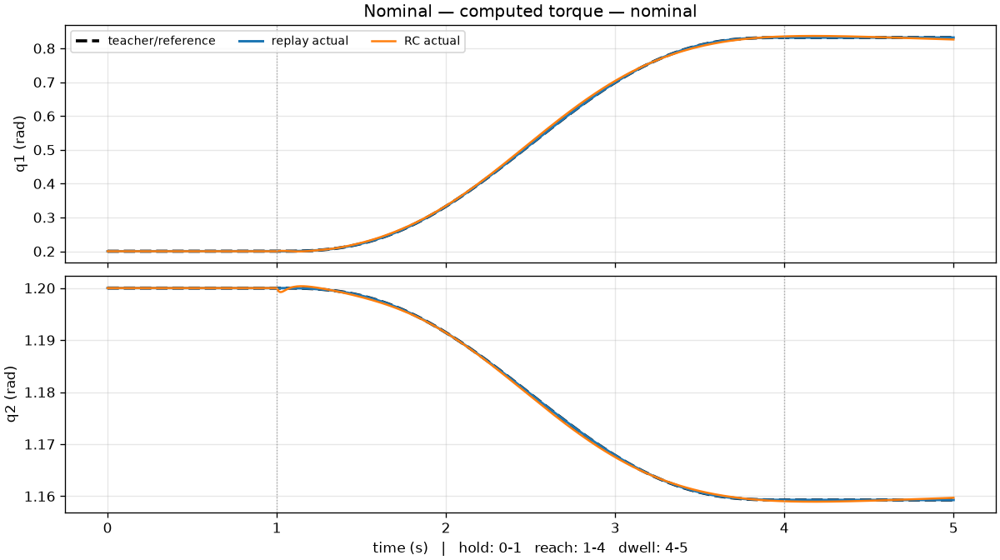 |

The visual difference is subtle because every method reaches the target; the
time series reveals replay's tighter reference tracking.

### Small posture fluctuation

Scenario `posture-small-20260903-03`: an unseen initial joint offset with norm
0.05 rad and no external force.

| RC + PD v2 | Replay + PD v2 |
| --- | --- |
| 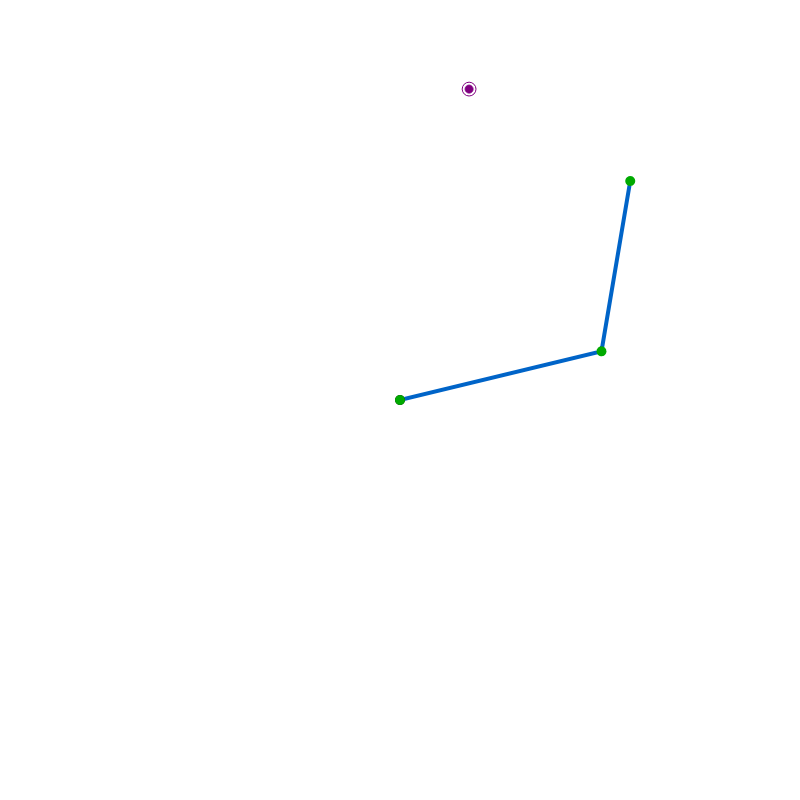 |  |
| RC+PD v2, `run-20260831-ec1191ddc035` | Replay+PD v2, `run-20260831-244e793b514f` |
| RC + computed torque | Replay + computed torque |
|  |  |
| RC+computed torque, `run-20260831-7fa865cdcc90` | Replay+computed torque, `run-20260831-4b68d57e2fac` |

| PD v2 joint trajectories | Computed-torque joint trajectories |
| --- | --- |
| 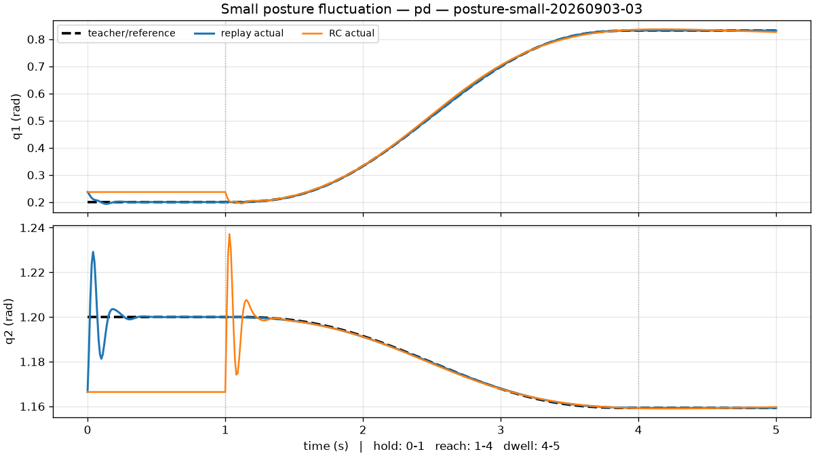 | 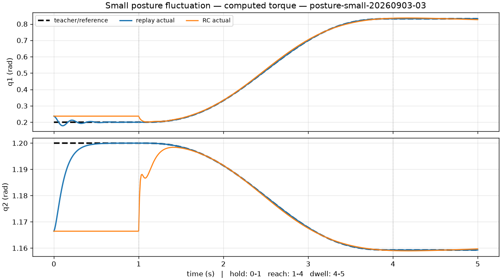 |

Both controllers first recover from an initial state that differs from the
teacher signal. The ESN then generates the learned reach from measured feedback.

### Large posture fluctuation

Scenario `posture-large-20260904-03`: an unseen initial joint offset with norm
0.10 rad and no external force.

| RC + PD v2 | Replay + PD v2 |
| --- | --- |
| 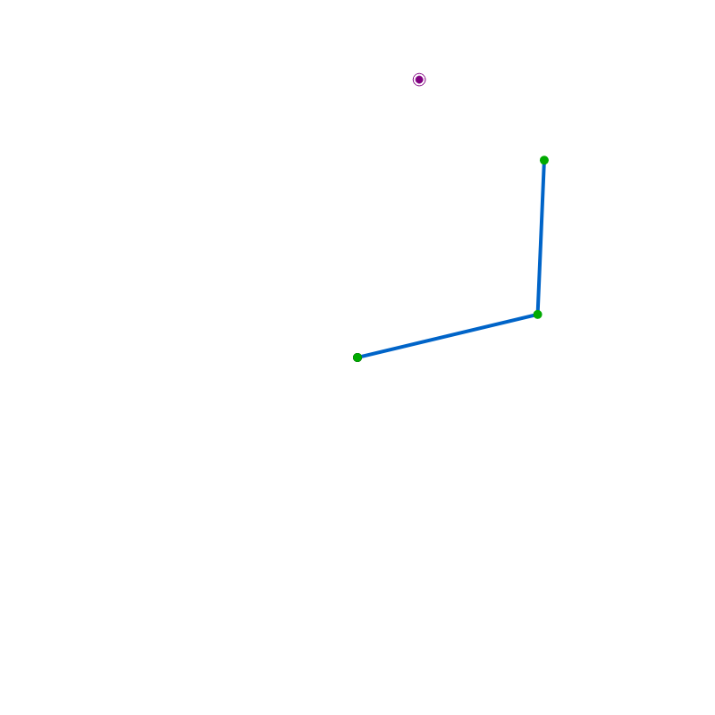 |  |
| RC+PD v2, `run-20260831-eeaf620bb2c6` | Replay+PD v2, `run-20260831-23e24d8dfaae` |
| RC + computed torque | Replay + computed torque |
|  |  |
| RC+computed torque, `run-20260831-0c1cd4d956c0` | Replay+computed torque, `run-20260831-144ec91a9a51` |

| PD v2 joint trajectories | Computed-torque joint trajectories |
| --- | --- |
| 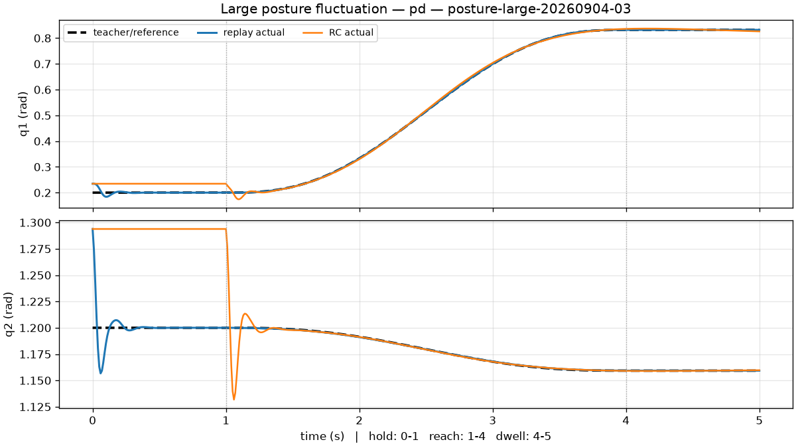 | 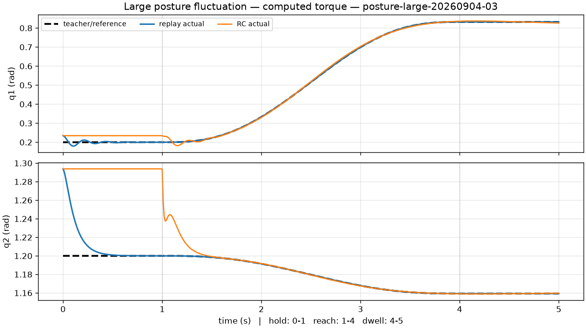 |

The larger initial mismatch makes the recovery transient more visible, but all
four runs still complete and meet the dwell criteria.

### Force

Scenario `force-12N-270deg`: the demonstrated posture plus a 12 N, 270-degree
endpoint-force pulse lasting 0.2 s from `t = 2 s`.

| RC + PD v2 | Replay + PD v2 |
| --- | --- |
|  |  |
| RC+PD v2, `run-20260831-c98f8f1156cc` | Replay+PD v2, `run-20260831-c24da9e6c486` |
| RC + computed torque | Replay + computed torque |
|  |  |
| RC+computed torque, `run-20260831-98e177f1a474` | Replay+computed torque, `run-20260831-530d72bc46f0` |

| PD v2 joint trajectories | Computed-torque joint trajectories |
| --- | --- |
| 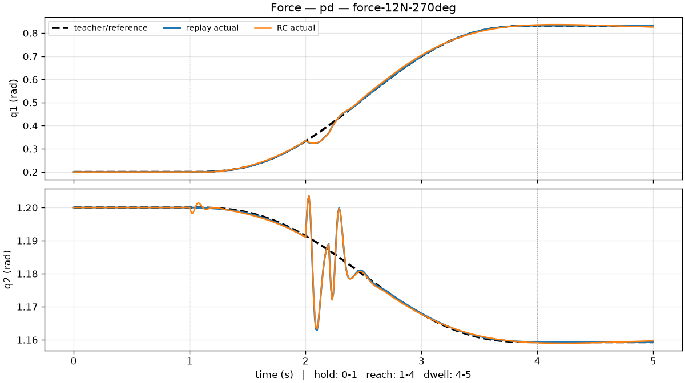 | 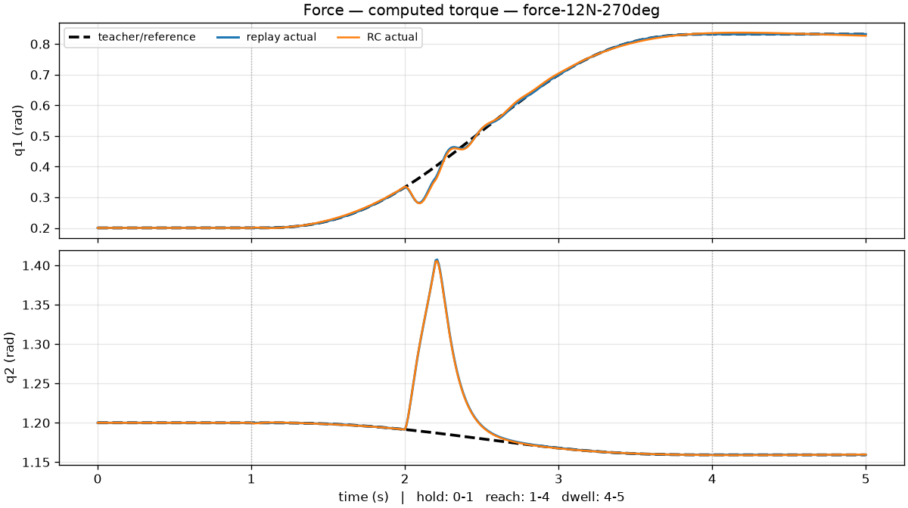 |

The pulse produces a localized deviation in both target-generation methods. The
larger computed-torque response is nearly shared by RC and replay, supporting
the interpretation that it is primarily a tracker effect.

### Combined

Scenario `combined-20260901-03-270deg`: an unseen 0.05 rad initial joint offset
combined with the same 12 N, 270-degree pulse.

| RC + PD v2 | Replay + PD v2 |
| --- | --- |
| 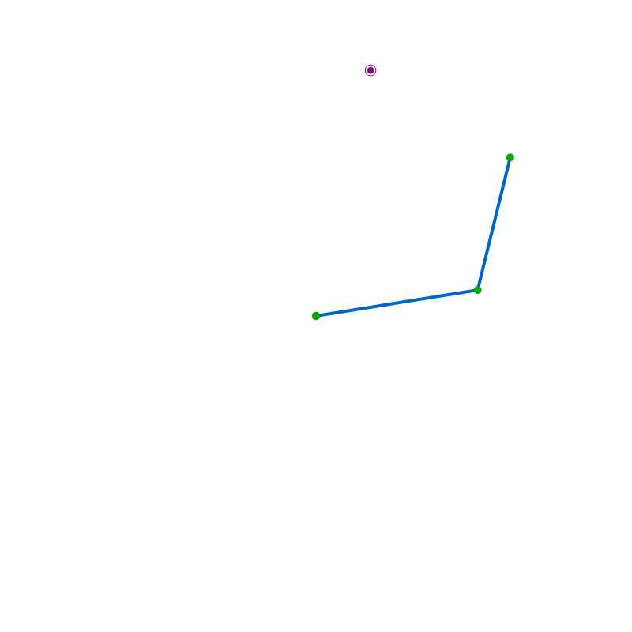 |  |
| RC+PD v2, `run-20260831-8658997d9ad9` | Replay+PD v2, `run-20260831-4db678e4956e` |
| RC + computed torque | Replay + computed torque |
|  |  |
| RC+computed torque, `run-20260831-0689609c5082` | Replay+computed torque, `run-20260831-340828190d94` |

| PD v2 joint trajectories | Computed-torque joint trajectories |
| --- | --- |
| 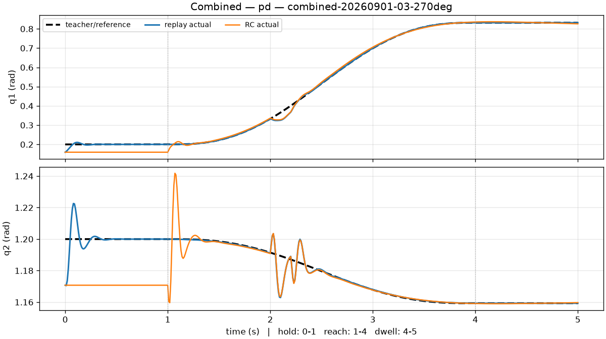 | 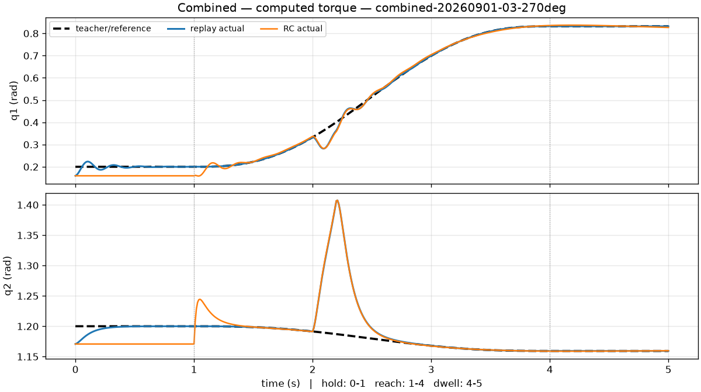 |

This class combines the two disturbances rather than testing either in
isolation. The displayed runs recover, reach, and satisfy the same dwell rule as
the other 256 confirmatory evaluations.

## Interpretation

This experiment establishes the intended vertical slice: immutable
demonstration data, teacher-forced ESN training, feedback-driven target
generation, two torque trackers, paired baselines, automated tuning, locked
robustness evaluation, and exact reproduction records. The learned generator is
stable enough to reach and dwell from the tested posture offsets and after the
tested force pulses.

It does **not** show that RC outperforms conventional control. Direct replay is
the more accurate reference follower, and a model-based reaching controller
would have additional knowledge unavailable to this single-demonstration ESN.
The meaningful result is that the same learned dynamical generator produced a
safe closed-loop reach across every held-out scenario, providing a foundation
for testing generalization in task 1-b and eventually online adaptation.

## Limitations and next steps

- The study is simulation-only and uses an exact, gravity-free two-link model;
  hardware noise, latency, and model mismatch are absent.
- Training uses one scripted demonstration of one target. A human demonstration
  has not yet been added to the final evidence.
- No matched Deep RL system was evaluated, so the single-trajectory result
  supports an RC data-efficiency hypothesis but does not quantify an advantage
  over Deep RL.
- Robustness is demonstrated only within the locked 0.10 rad posture and 12 N
  force envelope; it is not a general stability guarantee.
- The selected ESN lies near several search bounds, leaving optimization
  headroom.
- Confirmatory execution was intentionally one-shot, so it provides no
  repeat-run variance estimate.
- Online learning and adaptation are future milestones; the readout is fixed
  throughout every run reported here.

The next scientific step is task 1-b: several demonstrations of the same target
from different initial postures, followed by evaluation on unseen postures.

## Reproduction and visual sources

The complete evidence, exact metrics, provenance, and limitations are in
[report.md](report.md), with the machine audit in
[reproduction_audit.md](reproduction_audit.md). Run payloads remain in the
configured external store and are verified through Git-tracked pointer records.

The ten joint-trajectory plots are generated directly from the locked suite and
the external payloads with:

```bash
uv run python scripts/plot_task_1a_trajectories.py \
  --suite docs/experiments/task_1a/robustness_confirmatory_v2_recipe_v4.json \
  --output-dir /tmp/task-1a-trajectory-plots
```

Each animation was generated from the run record named below it with:

```bash
uv run python scripts/play_run.py --run <run-id> \
  --scenario configs/tasks/task_1a.toml \
  --export docs/experiments/task_1a/animations/<name>.gif --fps 12
```

They are curated illustrations, not replacements for the external 100 Hz run
payloads or the machine-readable confirmatory report.
