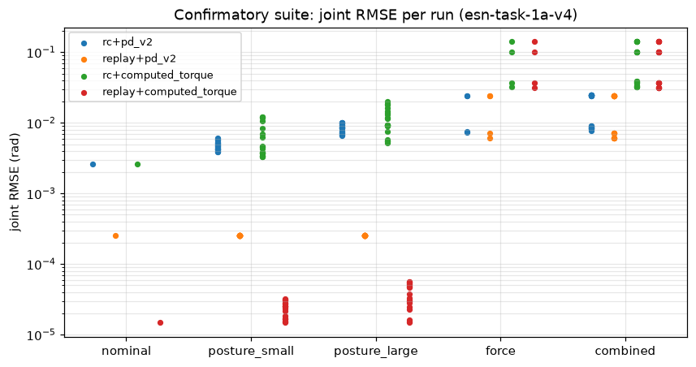
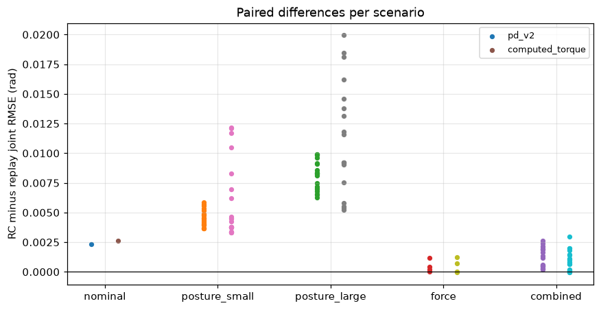
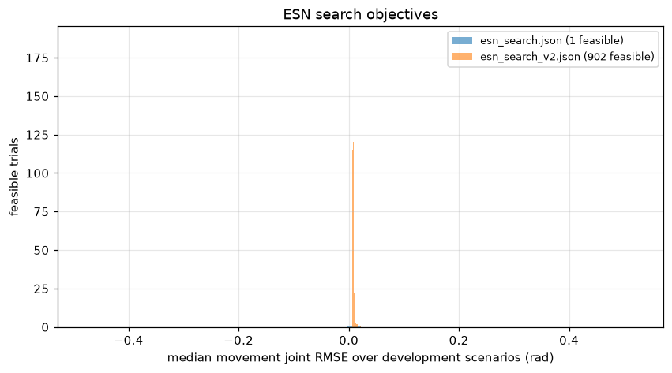

# Task 1-a results

## Summary

- Primary evidence: the locked confirmatory suite `robustness_confirmatory_v2_recipe_v4.json`
  (protocol `configs/evaluations/task_1a_confirmatory_v2.toml`,
  recipe `esn-task-1a-v4` from `data/records/models/model-20260831-1b9477aaa246.toml`, estimator cutoffs 29.98/10.94 Hz),
  run once from commit `19b9af3f5540`: 65 scenarios x
  4 arms = 260 runs, 0 failed.
- Confirmatory seeds: 20260901, 20260902, 20260903, 20260904, 20260905.
- Nominal RC+PD v2 joint RMSE: 0.002599 rad (replay 0.000254 rad).

## Primary metric

### Joint trajectory RMSE over the movement window (rad)

| arm | class | successes | median | q25 | q75 | min | max |
| --- | --- | --- | --- | --- | --- | --- | --- |
| rc+pd_v2 | nominal | 1 | 0.002599 | n/a | n/a | 0.002599 | 0.002599 |
| rc+pd_v2 | posture_small | 20 | 0.004716 | 0.004249 | 0.005204 | 0.003891 | 0.006109 |
| rc+pd_v2 | posture_large | 20 | 0.008515 | 0.007293 | 0.009344 | 0.006543 | 0.01018 |
| rc+pd_v2 | force | 4 | 0.01583 | 0.007461 | 0.02423 | 0.007344 | 0.02445 |
| rc+pd_v2 | combined | 20 | 0.01667 | 0.008532 | 0.02457 | 0.007821 | 0.02485 |
| replay+pd_v2 | nominal | 1 | 0.000254 | n/a | n/a | 0.000254 | 0.000254 |
| replay+pd_v2 | posture_small | 20 | 0.000254 | 0.000254 | 0.000254 | 0.000254 | 0.000254 |
| replay+pd_v2 | posture_large | 20 | 0.000254 | 0.000254 | 0.000254 | 0.000254 | 0.000254 |
| replay+pd_v2 | force | 4 | 0.01561 | 0.006868 | 0.02416 | 0.006177 | 0.02424 |
| replay+pd_v2 | combined | 20 | 0.01561 | 0.006868 | 0.02416 | 0.006177 | 0.02424 |
| rc+computed_torque | nominal | 1 | 0.002615 | n/a | n/a | 0.002615 | 0.002615 |
| rc+computed_torque | posture_small | 20 | 0.004394 | 0.003766 | 0.007305 | 0.003307 | 0.01219 |
| rc+computed_torque | posture_large | 20 | 0.009263 | 0.008678 | 0.01404 | 0.005222 | 0.02003 |
| rc+computed_torque | force | 4 | 0.06898 | 0.03554 | 0.1116 | 0.03241 | 0.1424 |
| rc+computed_torque | combined | 20 | 0.06995 | 0.03607 | 0.1117 | 0.03218 | 0.1428 |
| replay+computed_torque | nominal | 1 | 1.484e-05 | n/a | n/a | 1.484e-05 | 1.484e-05 |
| replay+computed_torque | posture_small | 20 | 2.523e-05 | 1.699e-05 | 2.784e-05 | 1.51e-05 | 3.191e-05 |
| replay+computed_torque | posture_large | 20 | 3.523e-05 | 2.762e-05 | 5.052e-05 | 1.509e-05 | 5.659e-05 |
| replay+computed_torque | force | 4 | 0.06898 | 0.03521 | 0.1115 | 0.03115 | 0.1417 |
| replay+computed_torque | combined | 20 | 0.06898 | 0.03521 | 0.1115 | 0.03115 | 0.1417 |

Per-joint RMSE medians over successful runs (rad):

| arm | class | joint 0 | joint 1 |
| --- | --- | --- | --- |
| rc+pd_v2 | nominal | 0.003648 | 0.0004529 |
| rc+pd_v2 | posture_small | 0.004542 | 0.004925 |
| rc+pd_v2 | posture_large | 0.006019 | 0.00929 |
| rc+pd_v2 | force | 0.01085 | 0.01817 |
| rc+pd_v2 | combined | 0.01129 | 0.01996 |
| replay+pd_v2 | nominal | 0.0002701 | 0.0002367 |
| replay+pd_v2 | posture_small | 0.0002701 | 0.0002367 |
| replay+pd_v2 | posture_large | 0.0002701 | 0.0002367 |
| replay+pd_v2 | force | 0.01033 | 0.01821 |
| replay+pd_v2 | combined | 0.01033 | 0.01821 |
| rc+computed_torque | nominal | 0.003687 | 0.0002866 |
| rc+computed_torque | posture_small | 0.004836 | 0.003898 |
| rc+computed_torque | posture_large | 0.008043 | 0.009421 |
| rc+computed_torque | force | 0.0173 | 0.09599 |
| rc+computed_torque | combined | 0.01804 | 0.0971 |
| replay+computed_torque | nominal | 1.734e-05 | 1.182e-05 |
| replay+computed_torque | posture_small | 3.366e-05 | 1.182e-05 |
| replay+computed_torque | posture_large | 4.839e-05 | 1.182e-05 |
| replay+computed_torque | force | 0.01495 | 0.09616 |
| replay+computed_torque | combined | 0.01495 | 0.09616 |

## Secondary metrics

### Dwell-window metrics (medians over successful runs)

| arm | class | endpoint mean (m) | endpoint RMS (m) | endpoint max (m) | endpoint p95 (m) | in-tolerance fraction | longest in-tolerance (s) | velocity RMS (rad/s) | velocity max (rad/s) |
| --- | --- | --- | --- | --- | --- | --- | --- | --- | --- |
| rc+pd_v2 | nominal | 0.001458 | 0.001617 | 0.002583 | 0.002247 | 1 | 1 | 0.009116 | 0.01648 |
| rc+pd_v2 | posture_small | 0.001457 | 0.001617 | 0.002594 | 0.002259 | 1 | 1 | 0.009115 | 0.01639 |
| rc+pd_v2 | posture_large | 0.001462 | 0.001622 | 0.002589 | 0.002254 | 1 | 1 | 0.009129 | 0.0164 |
| rc+pd_v2 | force | 0.001457 | 0.001616 | 0.002585 | 0.002265 | 1 | 1 | 0.009117 | 0.01646 |
| rc+pd_v2 | combined | 0.001457 | 0.001618 | 0.002579 | 0.002249 | 1 | 1 | 0.009122 | 0.01646 |
| replay+pd_v2 | nominal | 2.55e-06 | 6.093e-06 | 2.173e-05 | 1.784e-05 | 1 | 1 | 0.000173 | 0.0009219 |
| replay+pd_v2 | posture_small | 2.55e-06 | 6.093e-06 | 2.173e-05 | 1.784e-05 | 1 | 1 | 0.000173 | 0.0009219 |
| replay+pd_v2 | posture_large | 2.55e-06 | 6.093e-06 | 2.173e-05 | 1.784e-05 | 1 | 1 | 0.000173 | 0.0009219 |
| replay+pd_v2 | force | 2.55e-06 | 6.093e-06 | 2.173e-05 | 1.784e-05 | 1 | 1 | 0.000173 | 0.0009219 |
| replay+pd_v2 | combined | 2.55e-06 | 6.093e-06 | 2.173e-05 | 1.784e-05 | 1 | 1 | 0.000173 | 0.0009219 |
| rc+computed_torque | nominal | 0.00143 | 0.001585 | 0.002569 | 0.002234 | 1 | 1 | 0.00908 | 0.01694 |
| rc+computed_torque | posture_small | 0.001442 | 0.001599 | 0.002584 | 0.002248 | 1 | 1 | 0.009118 | 0.01677 |
| rc+computed_torque | posture_large | 0.001437 | 0.001593 | 0.002577 | 0.002243 | 1 | 1 | 0.009102 | 0.01685 |
| rc+computed_torque | force | 0.001454 | 0.001613 | 0.002556 | 0.002357 | 1 | 1 | 0.009076 | 0.0171 |
| rc+computed_torque | combined | 0.001454 | 0.001613 | 0.002551 | 0.002357 | 1 | 1 | 0.009083 | 0.01706 |
| replay+computed_torque | nominal | 2.193e-06 | 5.474e-06 | 2.368e-05 | 1.496e-05 | 1 | 1 | 0.0001037 | 0.0007137 |
| replay+computed_torque | posture_small | 2.193e-06 | 5.474e-06 | 2.368e-05 | 1.496e-05 | 1 | 1 | 0.0001037 | 0.0007137 |
| replay+computed_torque | posture_large | 2.193e-06 | 5.474e-06 | 2.368e-05 | 1.496e-05 | 1 | 1 | 0.0001037 | 0.0007137 |
| replay+computed_torque | force | 2.281e-06 | 5.776e-06 | 2.399e-05 | 1.662e-05 | 1 | 1 | 0.0001026 | 0.0005765 |
| replay+computed_torque | combined | 2.281e-06 | 5.776e-06 | 2.399e-05 | 1.662e-05 | 1 | 1 | 0.0001026 | 0.0005765 |

### Effort over the whole run (medians over successful runs, applied torque)

| arm | class | torque RMS (N*m) | torque peak (N*m) | saturation fraction | effort (N^2*m^2*s) |
| --- | --- | --- | --- | --- | --- |
| rc+pd_v2 | nominal | 0.02338 | 0.366 | 0 | 0.005476 |
| rc+pd_v2 | posture_small | 0.3261 | 8.975 | 0 | 1.066 |
| rc+pd_v2 | posture_large | 0.4522 | 10 | 0.001996 | 2.05 |
| rc+pd_v2 | force | 0.7288 | 6.466 | 0 | 5.598 |
| rc+pd_v2 | combined | 0.7939 | 8.975 | 0 | 6.44 |
| replay+pd_v2 | nominal | 0.01823 | 0.04584 | 0 | 0.003329 |
| replay+pd_v2 | posture_small | 0.1606 | 3.736 | 0 | 0.1942 |
| replay+pd_v2 | posture_large | 0.3424 | 5.865 | 0 | 0.9231 |
| replay+pd_v2 | force | 0.729 | 6.485 | 0 | 5.599 |
| replay+pd_v2 | combined | 0.7563 | 6.598 | 0 | 5.867 |
| rc+computed_torque | nominal | 0.02984 | 0.6038 | 0 | 0.00892 |
| rc+computed_torque | posture_small | 0.3467 | 10 | 0.001996 | 1.205 |
| rc+computed_torque | posture_large | 0.4835 | 10 | 0.001996 | 2.343 |
| rc+computed_torque | force | 0.6918 | 5.718 | 0 | 4.838 |
| rc+computed_torque | combined | 0.7818 | 10 | 0.001996 | 6.124 |
| replay+computed_torque | nominal | 0.01813 | 0.04563 | 0 | 0.003294 |
| replay+computed_torque | posture_small | 0.2441 | 3.091 | 0 | 0.5486 |
| replay+computed_torque | posture_large | 0.3707 | 4.748 | 0 | 1.279 |
| replay+computed_torque | force | 0.6884 | 5.793 | 0 | 4.783 |
| replay+computed_torque | combined | 0.7327 | 5.793 | 0 | 5.329 |

## Paired comparisons

### Paired comparisons (RC minus replay, same tracker and scenario)

| tracker | class | metric | pairs | both succeeded | median RC | median replay | median difference |
| --- | --- | --- | --- | --- | --- | --- | --- |
| pd_v2 | nominal | joint_rmse | 1 | 1 | 0.002599 rad | 0.000254 rad | 0.002345 rad |
| pd_v2 | nominal | dwell_endpoint_rms | 1 | 1 | 0.001617 m | 6.093e-06 m | 0.001611 m |
| pd_v2 | nominal | effort_torque_rms | 1 | 1 | 0.02338 N*m | 0.01823 N*m | 0.005151 N*m |
| pd_v2 | nominal | effort_saturation_fraction | 1 | 1 | 0 | 0 | 0 |
| pd_v2 | posture_small | joint_rmse | 20 | 20 | 0.004716 rad | 0.000254 rad | 0.004462 rad |
| pd_v2 | posture_small | dwell_endpoint_rms | 20 | 20 | 0.001617 m | 6.093e-06 m | 0.001611 m |
| pd_v2 | posture_small | effort_torque_rms | 20 | 20 | 0.3261 N*m | 0.1606 N*m | 0.1474 N*m |
| pd_v2 | posture_small | effort_saturation_fraction | 20 | 20 | 0 | 0 | 0 |
| pd_v2 | posture_large | joint_rmse | 20 | 20 | 0.008515 rad | 0.000254 rad | 0.008261 rad |
| pd_v2 | posture_large | dwell_endpoint_rms | 20 | 20 | 0.001622 m | 6.093e-06 m | 0.001616 m |
| pd_v2 | posture_large | effort_torque_rms | 20 | 20 | 0.4522 N*m | 0.3424 N*m | 0.1044 N*m |
| pd_v2 | posture_large | effort_saturation_fraction | 20 | 20 | 0.001996 | 0 | 0.001996 |
| pd_v2 | force | joint_rmse | 4 | 4 | 0.01583 rad | 0.01561 rad | 0.0003061 rad |
| pd_v2 | force | dwell_endpoint_rms | 4 | 4 | 0.001616 m | 6.093e-06 m | 0.00161 m |
| pd_v2 | force | effort_torque_rms | 4 | 4 | 0.7288 N*m | 0.729 N*m | -0.0008357 N*m |
| pd_v2 | force | effort_saturation_fraction | 4 | 4 | 0 | 0 | 0 |
| pd_v2 | combined | joint_rmse | 20 | 20 | 0.01667 rad | 0.01561 rad | 0.0008848 rad |
| pd_v2 | combined | dwell_endpoint_rms | 20 | 20 | 0.001618 m | 6.093e-06 m | 0.001611 m |
| pd_v2 | combined | effort_torque_rms | 20 | 20 | 0.7939 N*m | 0.7563 N*m | 0.0498 N*m |
| pd_v2 | combined | effort_saturation_fraction | 20 | 20 | 0 | 0 | 0 |
| computed_torque | nominal | joint_rmse | 1 | 1 | 0.002615 rad | 1.484e-05 rad | 0.0026 rad |
| computed_torque | nominal | dwell_endpoint_rms | 1 | 1 | 0.001585 m | 5.474e-06 m | 0.00158 m |
| computed_torque | nominal | effort_torque_rms | 1 | 1 | 0.02984 N*m | 0.01813 N*m | 0.01171 N*m |
| computed_torque | nominal | effort_saturation_fraction | 1 | 1 | 0 | 0 | 0 |
| computed_torque | posture_small | joint_rmse | 20 | 20 | 0.004394 rad | 2.523e-05 rad | 0.004368 rad |
| computed_torque | posture_small | dwell_endpoint_rms | 20 | 20 | 0.001599 m | 5.474e-06 m | 0.001594 m |
| computed_torque | posture_small | effort_torque_rms | 20 | 20 | 0.3467 N*m | 0.2441 N*m | 0.1023 N*m |
| computed_torque | posture_small | effort_saturation_fraction | 20 | 20 | 0.001996 | 0 | 0.001996 |
| computed_torque | posture_large | joint_rmse | 20 | 20 | 0.009263 rad | 3.523e-05 rad | 0.00924 rad |
| computed_torque | posture_large | dwell_endpoint_rms | 20 | 20 | 0.001593 m | 5.474e-06 m | 0.001588 m |
| computed_torque | posture_large | effort_torque_rms | 20 | 20 | 0.4835 N*m | 0.3707 N*m | 0.07209 N*m |
| computed_torque | posture_large | effort_saturation_fraction | 20 | 20 | 0.001996 | 0 | 0.001996 |
| computed_torque | force | joint_rmse | 4 | 4 | 0.06898 rad | 0.06898 rad | 0.0003625 rad |
| computed_torque | force | dwell_endpoint_rms | 4 | 4 | 0.001613 m | 5.776e-06 m | 0.001607 m |
| computed_torque | force | effort_torque_rms | 4 | 4 | 0.6918 N*m | 0.6884 N*m | 0.0002221 N*m |
| computed_torque | force | effort_saturation_fraction | 4 | 4 | 0 | 0 | 0 |
| computed_torque | combined | joint_rmse | 20 | 20 | 0.06995 rad | 0.06898 rad | 0.000813 rad |
| computed_torque | combined | dwell_endpoint_rms | 20 | 20 | 0.001613 m | 5.776e-06 m | 0.001608 m |
| computed_torque | combined | effort_torque_rms | 20 | 20 | 0.7818 N*m | 0.7327 N*m | 0.03941 N*m |
| computed_torque | combined | effort_saturation_fraction | 20 | 20 | 0.001996 | 0 | 0.001996 |

Distribution of the per-scenario joint RMSE difference (rad):

| tracker | class | pairs | median | q25 | q75 | min | max |
| --- | --- | --- | --- | --- | --- | --- | --- |
| pd_v2 | nominal | 1 | 0.002345 | n/a | n/a | 0.002345 | 0.002345 |
| pd_v2 | posture_small | 20 | 0.004462 | 0.003995 | 0.00495 | 0.003637 | 0.005855 |
| pd_v2 | posture_large | 20 | 0.008261 | 0.007039 | 0.00909 | 0.006289 | 0.009922 |
| pd_v2 | force | 4 | 0.0003061 | 0.0001662 | 0.0005928 | 3.269e-05 | 0.001167 |
| pd_v2 | combined | 20 | 0.0008848 | 0.0004735 | 0.00191 | 0.0002087 | 0.002617 |
| computed_torque | nominal | 1 | 0.0026 | n/a | n/a | 0.0026 | 0.0026 |
| computed_torque | posture_small | 20 | 0.004368 | 0.003744 | 0.007277 | 0.003292 | 0.01216 |
| computed_torque | posture_large | 20 | 0.00924 | 0.008657 | 0.01398 | 0.0052 | 0.01998 |
| computed_torque | force | 4 | 0.0003625 | 7.252e-06 | 0.0008442 | -2.697e-05 | 0.001257 |
| computed_torque | combined | 20 | 0.000813 | 0.0001534 | 0.001415 | -5.866e-05 | 0.002985 |

## Failures

Confirmatory suite: 0 failed run(s) of 260.

| report | label | arm | scenario | termination | failed criteria |
| --- | --- | --- | --- | --- | --- |
| robustness_dev_v1.json | development | rc+computed_torque | force-9N-225deg | completed | dwell_stationary |
| robustness_dev_v1.json | development | rc+computed_torque | combined-20261001-00-045deg | completed | dwell_in_tolerance |
| robustness_dev_v2_recipe_v3.json | development | rc+computed_torque | force-7.5N-030deg | completed | dwell_in_tolerance |
| robustness_dev_v2_recipe_v3.json | development | rc+computed_torque | combined-20261003-00-030deg | completed | dwell_in_tolerance |
| robustness_dev_v2_recipe_v3.json | development | rc+computed_torque | combined-20261004-01-030deg | completed | dwell_in_tolerance |

## Development evidence (not confirmatory)

### ESN searches

| report | protocol | budget | stored | pruned | feasible | best trial | best objective (rad) |
| --- | --- | --- | --- | --- | --- | --- | --- |
| esn_search.json | esn-search-1a | 120 | 120 | 10 | 1 | 13 | 0.02165 |
| esn_search_v2.json | esn-search-1a-v2 | 1000 | 1000 | 0 | 902 | 843 | 0.006577 |

### Reservoir-seed panel `esn_stability_v2.json`

| trial | own objective (rad) | feasible seeds | panel median | panel min | panel max |
| --- | --- | --- | --- | --- | --- |
| 843 | 0.006577 | 8/8 | 0.007125 | 0.006596 | 0.007853 |
| 854 | 0.006591 | 8/8 | 0.007178 | 0.006892 | 0.008129 |
| 887 | 0.006595 | 8/8 | 0.007822 | 0.007385 | 0.008901 |

### Training reports

| report | model config | recipe | fit RMSE (rad) | refit verified |
| --- | --- | --- | --- | --- |
| training_v2.json | configs/models/esn_task_1a_v2.toml | model-20260831-038a9b2c8432 | 0.0002144 | True |
| training_v3.json | configs/models/esn_task_1a_v3.toml | model-20260831-ea83321eeaa5 | 0.0007854 | True |
| training_v4.json | configs/models/esn_task_1a_v4.toml | model-20260831-1b9477aaa246 | 0.001736 | True |

### Development robustness suites

| report | recipe | arm | class | successes | RMSE median (rad) | RMSE max (rad) |
| --- | --- | --- | --- | --- | --- | --- |
| robustness_dev_v1.json | esn-task-1a-v3 | rc+pd_v2 | nominal | 1/1 | 0.0123 | 0.0123 |
| robustness_dev_v1.json | esn-task-1a-v3 | rc+pd_v2 | posture_small | 6/6 | 0.02591 | 0.0326 |
| robustness_dev_v1.json | esn-task-1a-v3 | rc+pd_v2 | posture_large | 6/6 | 0.05161 | 0.05639 |
| robustness_dev_v1.json | esn-task-1a-v3 | rc+pd_v2 | force | 4/4 | 0.01909 | 0.02827 |
| robustness_dev_v1.json | esn-task-1a-v3 | rc+pd_v2 | combined | 6/6 | 0.03355 | 0.04265 |
| robustness_dev_v1.json | esn-task-1a-v3 | rc+computed_torque | nominal | 1/1 | 0.01332 | 0.01332 |
| robustness_dev_v1.json | esn-task-1a-v3 | rc+computed_torque | posture_small | 6/6 | 0.0258 | 0.03373 |
| robustness_dev_v1.json | esn-task-1a-v3 | rc+computed_torque | posture_large | 6/6 | 0.05195 | 0.05532 |
| robustness_dev_v1.json | esn-task-1a-v3 | rc+computed_torque | force | 3/4 | 0.04755 | 0.1015 |
| robustness_dev_v1.json | esn-task-1a-v3 | rc+computed_torque | combined | 5/6 | 0.0555 | 0.1015 |
| robustness_dev_v2_recipe_v3.json | esn-task-1a-v3 | rc+pd_v2 | nominal | 1/1 | 0.0123 | 0.0123 |
| robustness_dev_v2_recipe_v3.json | esn-task-1a-v3 | rc+pd_v2 | posture_small | 6/6 | 0.02096 | 0.02698 |
| robustness_dev_v2_recipe_v3.json | esn-task-1a-v3 | rc+pd_v2 | posture_large | 6/6 | 0.04884 | 0.06293 |
| robustness_dev_v2_recipe_v3.json | esn-task-1a-v3 | rc+pd_v2 | force | 4/4 | 0.01926 | 0.02348 |
| robustness_dev_v2_recipe_v3.json | esn-task-1a-v3 | rc+pd_v2 | combined | 6/6 | 0.0265 | 0.03281 |
| robustness_dev_v2_recipe_v3.json | esn-task-1a-v3 | rc+computed_torque | nominal | 1/1 | 0.01332 | 0.01332 |
| robustness_dev_v2_recipe_v3.json | esn-task-1a-v3 | rc+computed_torque | posture_small | 6/6 | 0.02203 | 0.02806 |
| robustness_dev_v2_recipe_v3.json | esn-task-1a-v3 | rc+computed_torque | posture_large | 6/6 | 0.0498 | 0.06393 |
| robustness_dev_v2_recipe_v3.json | esn-task-1a-v3 | rc+computed_torque | force | 3/4 | 0.02718 | 0.07803 |
| robustness_dev_v2_recipe_v3.json | esn-task-1a-v3 | rc+computed_torque | combined | 4/6 | 0.03335 | 0.07879 |
| robustness_dev_v2_recipe_v4.json | esn-task-1a-v4 | rc+pd_v2 | nominal | 1/1 | 0.002599 | 0.002599 |
| robustness_dev_v2_recipe_v4.json | esn-task-1a-v4 | rc+pd_v2 | posture_small | 6/6 | 0.004088 | 0.004538 |
| robustness_dev_v2_recipe_v4.json | esn-task-1a-v4 | rc+pd_v2 | posture_large | 6/6 | 0.007723 | 0.00874 |
| robustness_dev_v2_recipe_v4.json | esn-task-1a-v4 | rc+pd_v2 | force | 4/4 | 0.01101 | 0.01543 |
| robustness_dev_v2_recipe_v4.json | esn-task-1a-v4 | rc+pd_v2 | combined | 6/6 | 0.01147 | 0.0158 |
| robustness_dev_v2_recipe_v4.json | esn-task-1a-v4 | rc+computed_torque | nominal | 1/1 | 0.002615 | 0.002615 |
| robustness_dev_v2_recipe_v4.json | esn-task-1a-v4 | rc+computed_torque | posture_small | 6/6 | 0.003794 | 0.004617 |
| robustness_dev_v2_recipe_v4.json | esn-task-1a-v4 | rc+computed_torque | posture_large | 6/6 | 0.009627 | 0.01991 |
| robustness_dev_v2_recipe_v4.json | esn-task-1a-v4 | rc+computed_torque | force | 4/4 | 0.0427 | 0.08862 |
| robustness_dev_v2_recipe_v4.json | esn-task-1a-v4 | rc+computed_torque | combined | 6/6 | 0.04296 | 0.08867 |

## Playback

Any curated run can be inspected kinematically with the pinned `skelarm` player
(`docs/PLAN.md` section 7.5); the exported log is a local, disposable product.
The nominal paired runs:

| report | tracker | RC run | replay run |
| --- | --- | --- | --- |
| paired_nominal_ct.json | computed_torque | run-20260831-2dce459a5acc | run-20260831-86704cde37a8 |
| paired_nominal_pd.json | pd | run-20260831-3fef7abca22a | run-20260831-e5265c2773a6 |

Play the nominal RC+PD v2 run:

```
uv run python scripts/play_run.py --run run-20260831-3fef7abca22a --scenario configs/tasks/task_1a.toml
```

## Limitations

- Simulation only: all results come from the `skelarm` planar two-link model at 100 Hz with the frozen tracker gains; no hardware, sensor noise, latency, or model mismatch beyond the configured perturbations is represented.
- One demonstration, one task: the recipe was trained on a single scripted demonstration of task 1-a and evaluated against it; generalization to other targets, speeds, or postures beyond the perturbation classes is untested.
- The RC generator tracks the demonstration less precisely than the direct replay in every posture class (median RC minus replay joint RMSE up to about 0.008 rad under PD v2); under the 12 N pulses the difference vanishes because the pulse dominates both, so the force classes do not separate the methods.
- Computed torque absorbs the confirmatory pulse worse than PD v2 (about 0.07 rad for RC and replay alike); it is a secondary comparison and the ESN objective was tuned with PD v2 only.
- Feasibility in tuning is defined by the scenario's dwell criteria and the saturation bound; the selected recipe sits on several bounds of the v2 search space (spectral radius, sparsity, velocity cutoff high; input scaling low), which indicates optimization headroom rather than a limitation of the candidate.
- Development and confirmatory perturbations differ in levels, timing, directions, and seeds by design; the confirmatory suite was run exactly once for this study version, so its estimates carry no repeat-run variance.
- Reservoir-seed sensitivity was probed with a fixed eight-seed panel on the three leading trials only.
- The experiment state that is not in Git (run payloads, models, MLflow and Optuna databases) lives in the external storage root; the committed pointer records and digests make it verifiable but not self-contained.

## Plots




