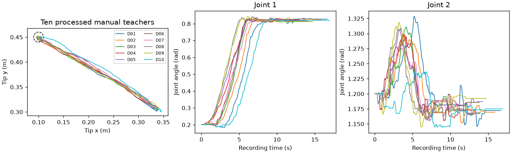
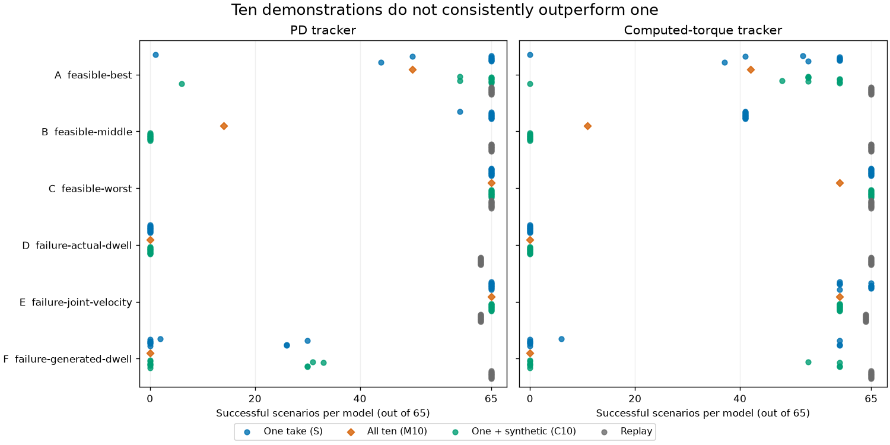
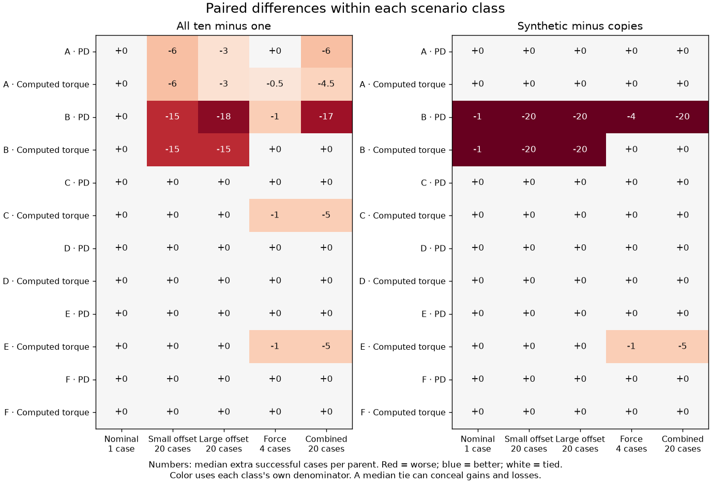
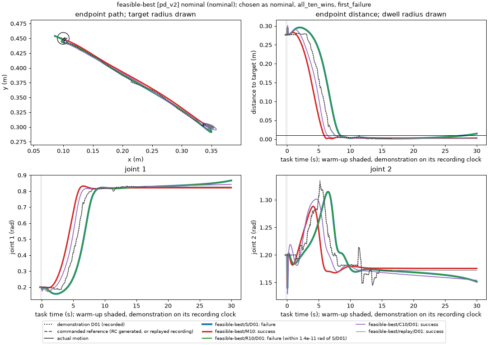
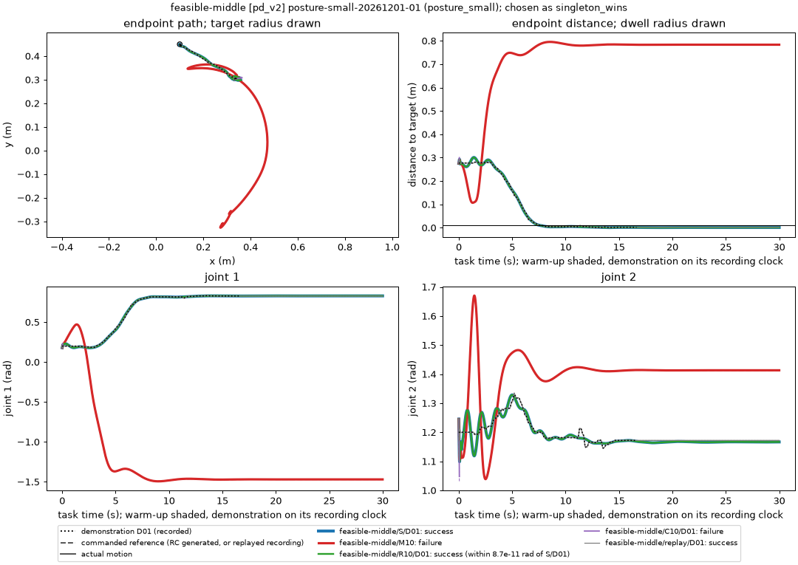
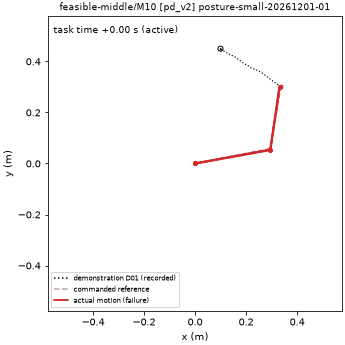

<!-- Copyright (c) 2026 Hiroshi Atsuta -->
<!-- SPDX-License-Identifier: GPL-3.0-only -->

# Ten manual demonstrations did not consistently improve reaching robustness

**Task 1-a manual-demonstration study · M3MAN-012 · 21 September 2026**
Interpretation by the reporting assistant, for owner review. Evidence: the locked
study, derived results v1, and reproduction audit v4. No new training, tuning,
or simulation was performed for this report.

## What the experiment tells us

Training on ten human-guided demonstrations **did not reliably outperform
training on one** under the tested learning and control setup. Across the six
fixed model configurations and two trackers, the median paired effect of ten
versus one was negative in six combinations and tied in six; it was positive
in none. A tie sometimes means both methods succeeded everywhere, and sometimes
means both failed. Ten demonstrations did rescue some poor singleton models,
but those gains did not translate into a consistent advantage over the ten
singleton alternatives.

Three other findings sharpen that answer:

- **Copying a demonstration changed no success/failure outcome.** All 7,800
  matched singleton-versus-copy comparisons agreed. With regularization held
  equivalent, repeating the same information bought no robustness.
- **Synthetic variation was unreliable.** It rescued individual recordings in
  some configurations, harmed others, and reduced one otherwise strong
  configuration to zero successes for every parent under both trackers.
- **The recordings themselves were usually trackable.** Replay succeeded in
  7,750 of 7,800 runs. The much larger failures of learned motion therefore
  cannot be explained simply by saying that human recordings were impossible
  for the simulated arm to follow.

The evidence supports a negative result for **“more demonstrations improve this
fixed learner without further changes.”** It does not establish that diverse
human teaching is generally unhelpful. The configuration and tracker mattered
substantially, and the study did not tune the learner for this new data.
[Counts](../results/arm_summary_v1.csv),
[paired comparisons](../results/contrast_summary_v1.csv),
[verified result index](../results/results_v1.md).

## What was taught, and what counted as success

One operator guided a **simulated, gravity-free, two-joint arm with a mouse**.
These are human-authored kinematic demonstrations, not physical robot teaching
or force measurements. Every take started at joint angles `[0.2, 1.2]` rad and
ended near the same tip target, `[0.10, 0.45]` m. Natural pre-roll fluctuations,
movement timing and the whole recorded transient were retained.

Ten takes were accepted from eleven saved attempts in session `study-01`.
Attempt 3 was excluded for a 0.0612 s sample gap, exceeding the frozen 0.06 s
limit; collection continued until ten passed. The accepted processed recordings
last **12.87–16.92 s**. They were acquired at 50 Hz using actual timestamps,
smoothed and reconstructed on the common 100 Hz training/control grid. They
were neither time-warped to match one another nor given invented stationary
tails. [Acquisition settings](../acquisition_readiness_v1.md),
[batch 1](../bank/bank_v1_batch_001.md), [batch 2](../bank/bank_v1_batch_002.md).

*All ten teachers are shown on their own recording clocks. The dashed circle
is the 1 cm target region. The tip paths look similar, while the second joint
and movement onset show appreciable variation. This is the variation the
experiment tested; the plot alone does not identify which differences caused
a model to succeed or fail.*

The learned model observes joint position and velocity, maintains a reservoir
state, and predicts the next desired joint position. A separate tracker makes
the arm follow that generated reference. The two tested trackers were a
proportional–derivative tracker (**PD**) and a **computed-torque tracker**, which
also uses the arm's dynamics. Neither tracker was tuned in this study.

Every evaluation allowed **30 s after activation**, regardless of teacher
length. Success required completion of that horizon and at least **one
continuous final second** within 1 cm of the target, with both joint speeds
at most 0.05 rad/s. Generated references and effort also had to satisfy the
protocol. During movement, either joint exceeding **6 rad/s** triggered an
abort; the tighter **0.05 rad/s** threshold applied to qualifying dwell, not
the whole reach. For learned motion, the generated reference itself also had
to respect position, speed and workspace limits and meet the dwell condition.
Excessive torque saturation—asking for more torque than allowed too often—was
another failure criterion. Individual unsafe runs were aborted, and subsequent
cases started from fresh resets. A brief pass through the target, or arriving
near it while still moving too fast, was insufficient.

Each model faced the same 65 cases under each tracker:

| Case class | Cases | What changed |
| --- | ---: | --- |
| Nominal | 1 | Exact recorded starting posture |
| Small posture offset | 20 | Starting joint posture at the 0.05 rad perturbation level |
| Large posture offset | 20 | Starting joint posture at the 0.10 rad perturbation level |
| Force | 4 | A 12 N, 0.2 s tip-force pulse, one of four directions |
| Combined | 20 | Posture offset and force pulse |

A pulse fired only after the measured arm qualified for 0.5 s of target dwell;
force cases also required subsequent recovery and final dwell. Failure to
qualify for the pulse was recorded as failure, not credited as surviving a
force that never occurred. Consequently, a force-class loss can reflect failure
to reach the trigger condition as well as failure to recover afterward.
[Evaluation protocol](../../../../configs/evaluations/task_1a_manual_dev_v1.toml).

The all-65 score below gives every case one count. Thus the classes containing
20 cases contribute more than the four force cases or single nominal case.
The class-specific plot keeps those denominators visible.

## The comparison was about information, not repetition count

| Name used below | Training data | Number of fitted models per configuration |
| --- | --- | ---: |
| **One take (S)** | One accepted recording; repeat for D01 through D10 | 10 |
| **All ten (M10)** | All ten recordings together | 1 |
| **Copies (R10)** | Ten exact copies of one recording; repeat for each parent | 10 |
| **Synthetic (C10)** | One recording plus nine contractive synthetic episodes from it | 10 |
| **Replay** | Play each recording through the same tracker and causal derivative policy, then hold its last posture | 10 baselines |

Each episode had equal total training weight even though lengths differed.
Regularization was scaled with episode count so copies could not improve the
result merely by weakening its effective strength. The input transformation
was frozen from the historical scripted dataset. These controls distinguish
this experiment from the predecessor, where repetition effects were consistent
with reduced effective regularization.

There is **one M10 model per configuration**, reused in its ten paired
comparisons. Those ten comparisons are not ten independent M10 fits. Likewise,
ten copies or nine synthetic episodes do not constitute additional human
observations. [Training design](../plan.md#4-training-arms-and-regularization-controls),
[numerical checks](../numerical_validation_v1.md).

## Ten versus one: the losses exceed the gains

The six configurations were inherited and frozen before the manual comparison.
Their names describe their roles in an earlier study, **not their rank here**.
For readability, this report assigns letters in their existing frozen order:

| Letter | Stored configuration label | Warm-up before activation |
| --- | --- | ---: |
| A | `feasible-best` | 0.25 s |
| B | `feasible-middle` | 0 s |
| C | `feasible-worst` | 1 s |
| D | `failure-actual-dwell` | 0.25 s |
| E | `failure-joint-velocity` | 1 s |
| F | `failure-generated-dwell` | 0 s |

Each configuration includes its own reservoir, regularization and derivative
filter settings. Differences between configurations cannot be attributed to
warm-up alone. Their full definitions are in the
[study manifest](../study_manifest_v1.json).

*Each blue, green or grey point represents one parent-specific model or replay
baseline; there are ten of each per configuration and tracker. Orange diamonds
represent the one M10 model. Points overlap where counts agree. Copy controls
are omitted from the plot because their scores equal the singleton scores.*

The table gives M10's actual score and the **median singleton score with its
full range**. The paired difference is M10 minus the singleton, measured in
extra successful cases out of 65. The last column counts parents for which
that difference was positive, negative or zero.

| Config. / tracker | S median [range] | M10 | Paired difference: median [range] | Parents better / worse / tied |
| --- | ---: | ---: | ---: | ---: |
| A / PD | 65 [1–65] | 50 | −15 [−15…+49] | 2 / 7 / 1 |
| A / computed torque | 56 [0–59] | 42 | −14 [−17…+42] | 3 / 7 / 0 |
| B / PD | 65 [59–65] | 14 | −51 [−51…−45] | 0 / 10 / 0 |
| B / computed torque | 41 [41–41] | 11 | −30 [−30…−30] | 0 / 10 / 0 |
| C / PD | 65 [65–65] | 65 | 0 [0…0] | 0 / 0 / 10 |
| C / computed torque | 65 [65–65] | 59 | −6 [−6…−6] | 0 / 10 / 0 |
| D / PD | 0 [0–0] | 0 | 0 [0…0] | 0 / 0 / 10 |
| D / computed torque | 0 [0–0] | 0 | 0 [0…0] | 0 / 0 / 10 |
| E / PD | 65 [65–65] | 65 | 0 [0…0] | 0 / 0 / 10 |
| E / computed torque | 65 [59–65] | 59 | −6 [−6…0] | 0 / 6 / 4 |
| F / PD | 0 [0–30] | 0 | 0 [−30…0] | 0 / 4 / 6 |
| F / computed torque | 0 [0–59] | 0 | 0 [−59…0] | 0 / 4 / 6 |

[Source: `M10-S`, class `all`](../results/contrast_summary_v1.csv).
The `M10-R10` comparison gives the same values because copies changed no
scenario verdict. These ranges describe the ten observed parents, not
confidence intervals for a population of future demonstrations.

**B is the clearest loss:** every singleton beats M10 under both trackers.
Under PD, nine singletons solve all 65 cases and the remaining one solves 59;
M10 solves only 14. This is not an averaging artifact or a comparison against
one unusually fortunate recording.

**A contains genuine gains for weaker singletons.** With PD,
M10 beats D01's singleton by 49 cases and D10's by six, ties D03, and loses
15 cases against each of seven other singletons. For D01, the paired tally is
49 improved cases, none worsened, one shared success and 15 shared failures.
That is a real rescue of a weak singleton, but not a broad advantage over
single-demonstration training.

**Ties require context.** C/PD and E/PD have a ceiling: every tested model
succeeds everywhere. D has a floor: every learned arm fails everywhere.
F's median tie conceals losses against four parents. Neither ceiling nor floor
can establish an advantage for ten demonstrations.

*Numbers are extra successful cases, not percentages. Color divides by each
class's own case count. A white zero cell can conceal parent-specific gains
and losses; it is not evidence of identical trajectories.*

The class breakdown matters especially for B. With PD, M10 succeeds in the
nominal case, but only **5/20 small-offset and 2/20 large-offset cases**;
every singleton succeeds in all 40 posture-only cases. With computed torque,
B's singleton successes are exactly the 41 nominal/posture-only cases; all
24 force/combined cases fail. A nominal demonstration alone would therefore
make B look substantially more robust than the full evaluation shows.

## Copies are neutral; synthetic variation is not a dependable substitute

**S and R10 agree on success/failure for every matched scenario:** 60 parented
models × 65 cases × two trackers = 7,800 comparisons. This is consistent with
the weighted-ridge equivalence established before the behavioral study. It
is a statement about verdicts, not byte-identical trajectories; tiny numerical
differences remain. There is no reason from these results to collect or store
copies as if they were new training information.

**C10 changes behavior, sometimes drastically.** It preserves the parent's
start and terminal dwell, but perturbs the transient. Preserving those teacher
properties does not guarantee the learned closed-loop behavior will retain them.

- In **A/PD**, C10 raises D01 from **1 to 59** successes, but drops D10 from
  **44 to 6**. The latter net loss of 38 comprises **3 improved and 41 worsened
  cases**, with three shared successes and 18 shared failures. A small positive
  pooled gain would hide this risk. Across parents, A/PD's median C10−R10
  difference is zero, with range **−38 to +58**.
- In **B**, all ten C10 models score **0/65 under both trackers**. Their
  singleton/copy counterparts score 59–65 under PD and 41 under computed
  torque. This is a strong negative result for this augmentation with B.
- In **C**, synthetic and singleton/copy models all score 65/65 with both
  trackers. In **E/PD** they also all score 65; E/computed torque loses six
  cases for six parents and ties four. **D stays at zero.**
- In **F**, variation helps some parents but leaves the median paired effect
  at zero. A few gains do not turn it into a consistently robust arm.

For the fourth planned contrast, **M10 versus C10**, M10's median advantage is
positive only in B: +14 cases under PD and +11 under computed torque, where
C10 fails completely. M10 is worse in A (−15 PD, −11 computed torque) and
C/computed torque (−6), and tied in the remaining combinations. There is no
universal winner between ten human demonstrations and this synthetic recipe.
[All paired differences and parent counts](../results/contrast_summary_v1.csv).

## Replay provides a useful reference

Each parent-matched replay baseline solves **63–65 of 65 cases**, depending on
configuration and tracker. In B/PD, replay solves every case: the median paired
differences against replay are 0 for S and R10, −51 for M10 and −65 for C10.
This supports the interpretation that the large B losses arise with the learned
motion, even though the source recordings can be followed under those tests.

Replay is not unbeatable. In E/PD, all learned models solve 65/65, while each
replay baseline solves 63/65: a two-case advantage for every learned arm,
including the singleton. That gain does not favor ten demonstrations over one.
Replay here is a fixed recording followed by a tracker; it is a trackability
reference for this same target, not evidence of learning a new task.
The four parent-matched replay contrasts are retained in the
[contrast summaries](../results/contrast_summary_v1.csv).

## What the failures look like

These two illustrations use cases from the **predeclared representative rule**,
which explicitly includes examples favoring either side. They explain behavior;
the full paired tables above support the conclusion.

### Ten helps one weak singleton: A, nominal start, PD

D01's singleton finishes **14.7 mm** from the target, outside the 10 mm
region. M10 finishes **2.84 mm** away and qualifies for its final continuous
dwell from task time **6.12 s** onward. C10 also succeeds. S and R10 are
visually coincident; their joint trajectories differ by only about
`1.4 × 10⁻¹¹` rad in this case. This is the same parent whose all-scenario
score improves markedly with additional variation.

### Ten hurts a successful singleton: B, a small starting offset, PD

For `posture-small-20261201-01`, S/D01 succeeds and finishes **1.13 mm** from
the target. M10 finishes **783 mm** away and has no final qualifying dwell.
C10/D01 records a joint-speed abort. This is a substantial change in learned
behavior, not merely crossing the 10 mm boundary by a small numerical amount.

*Animation: solid arm = actual motion; faint dashed arm = commanded reference;
dotted path = D01 teacher. One frame per second of task time, including the
last sample for this zero-warm-up 30 s run. The source is the same frozen case
as the plot; it is not a newly simulated example. The
[earlier successful M10 animation](../results/figures/feasible-best__pd_v2__nominal__M10.gif)
shows the contrasting nominal A case.*

Across the study, recorded failure reasons include actual joint-speed aborts,
invalid generated-reference speeds, no final dwell and failure to qualify for
the force trigger. For example, D fails through speed-related criteria under
both trackers despite its historical `failure-actual-dwell` name. With B/PD,
M10's 51 failures comprise **33 final-dwell failures, 15 missing triggers and
three joint-speed aborts**. Those are reported deciding reasons; one run can
violate more than one physical requirement. The per-run table preserves the
underlying measurements and criteria. [Table access](../results/usage_v1.md#runs).

## Interpretation and practical implications

**Observed:** the same recordings are generally followable by replay, and some
unchanged configurations learn highly robust singleton behavior. Adding
recordings or synthetic episodes can nevertheless degrade reaching and holding.
The evidence points to an interaction between the training construction,
learned reference generator and feedback dynamics, rather than a simple
shortage of demonstration count.

**Plausible explanations, not established causes:** fitting several transient
histories may force a readout compromise that changes its autonomous behavior;
synthetic transients may alter the learned dynamics in ways their preserved
start and dwell do not constrain. The reservoir has memory, so this is not
proof that differing paths present mathematically contradictory instantaneous
targets. Neither explanation was isolated by this experiment. A future
investigation would need controlled ablations, rather than selecting one story
from these plots.

The tracker is part of the result. Computed torque is not automatically better:
B's singleton performance drops sharply on force cases, while C's singleton
models solve every case under both trackers. The inherited labels are likewise
poor guides: C and E perform strongly here despite being called “worst” or
“failure” historically. These observations do not authorize selecting and
deploying a new best configuration from development results.

For this task, **do not assume more takes or contractive noise are a robustness
upgrade**. Keep a singleton baseline and verify multi-demonstration behavior on
perturbed starts and disturbances, not just nominal reaches. Copies remain a
numerical control, not an information source. A sensible next research question
is why B loses robustness under multi-episode fitting while C is largely
insensitive, with independent validation after any tuning. That is a proposed
follow-up only: no additional recordings, tuning or confirmatory study are
included or started here.

## How far this conclusion reaches

- **One operator, one session, one start and one target.** The ten teachers are
  genuine repeated performances, but not independent operators or tasks.
- **Fixed historical configurations and development scenarios.** The six
  configurations were not optimized for the new manual bank. The 65 cases reuse
  locked development draws; this is not a fresh held-out generalization test.
  Each configuration has one fixed reservoir seed. Configuration differences
  combine several settings and cannot identify a single causal parameter.
- **Overlapping training sets.** M10 contains each comparator's singleton.
  Parents, copy controls and repeated deterministic runs are dependent; this
  report gives observed differences and ranges, without population confidence
  intervals or significance claims.
- **A finite simulation protocol.** A 30 s success is not indefinite stability
  or hardware safety. Small changes in paths can matter at thresholds, although
  the broad B losses and its illustrated large endpoint error are not just
  marginal threshold crossings.
- **Diagnostic definitions were documented after execution.** Departure latency,
  acceleration and final-dwell timing describe the runs; they were not used to
  choose a winner after the fact. The primary success protocol and comparison
  design were frozen beforehand. Lower endpoint error alone is not success.

## Evidence, reproduction and review status

The full study contains **186 learned models and 60 replay banks**, covering
24,180 learned-motion runs and 7,800 replay runs with none missing. The overall
success counts, **14,184** and **7,750**, are accounting totals; the arms have
different numbers of models, so those pooled totals do not answer ten versus
one. The configuration/tracker/parent comparisons above do.

A storage failure interrupted execution. The evidence was copied, damaged
leftovers quarantined and intact results verified before resume. This history
is preserved in the [execution account](../execution_account_v1.md).
[Audit v4](../audit/reproduction_audit_v4.md) re-judged all 31,980 runs from
verified arrays, rebuilt aggregates, and reproduced the frozen 300-run subset
bitwise. The [superseded v3 audit](../audit/superseded/README.md) remains available
with its gate failure; passing v4 is the current audit.

For this report, the assistant independently checked the derived counts,
comparisons and representative selections during review, and subsequently
re-judged 60 real runs across all configurations, classes and both RC/replay
sources. The full audit uses the evaluation's own definitions; it demonstrates
reproduction under those definitions, not an independently proved physical
model or external generalization.

The report's figures are regenerated from the audited evidence by the retained
[rendering script](../../../../scripts/render_manual_report.py).
[Reproduction instructions](reproduce.md) include the original case identifiers,
commands, input/output fingerprints and a path to every underlying result.
Presentation assets were produced in the reporting worktree; their manifest
records that dirty state separately from the clean simulation and audit
provenance. No experimental evidence was rewritten.

**M3MAN-012 deliverable: ready for owner review.** M3MAN-GATE remains the owner's
decision; acceptance of this report does not imply new tuning, confirmation,
physical robot operation or deployment.
