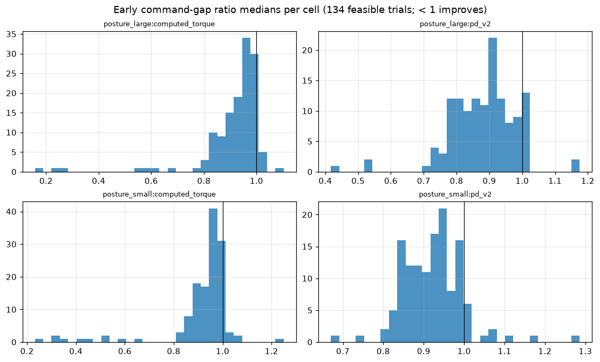
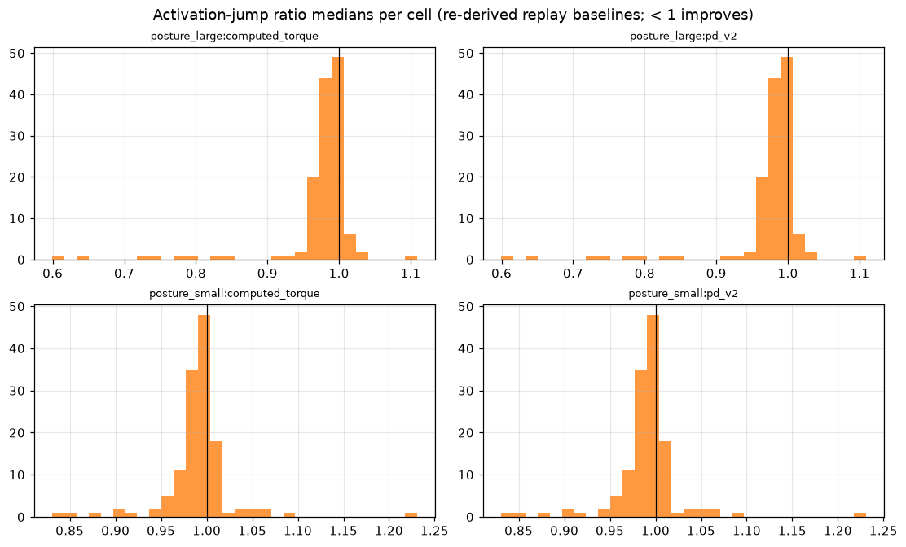
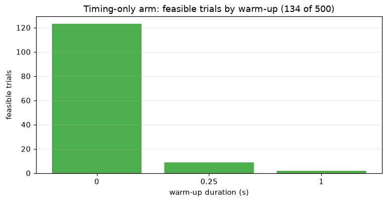
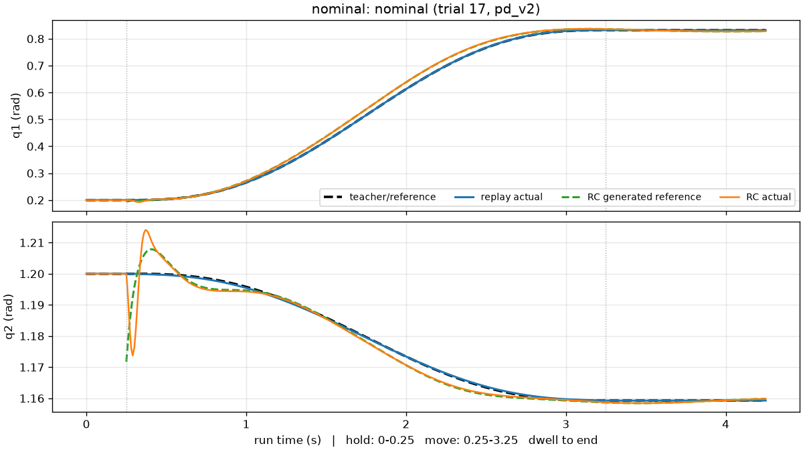
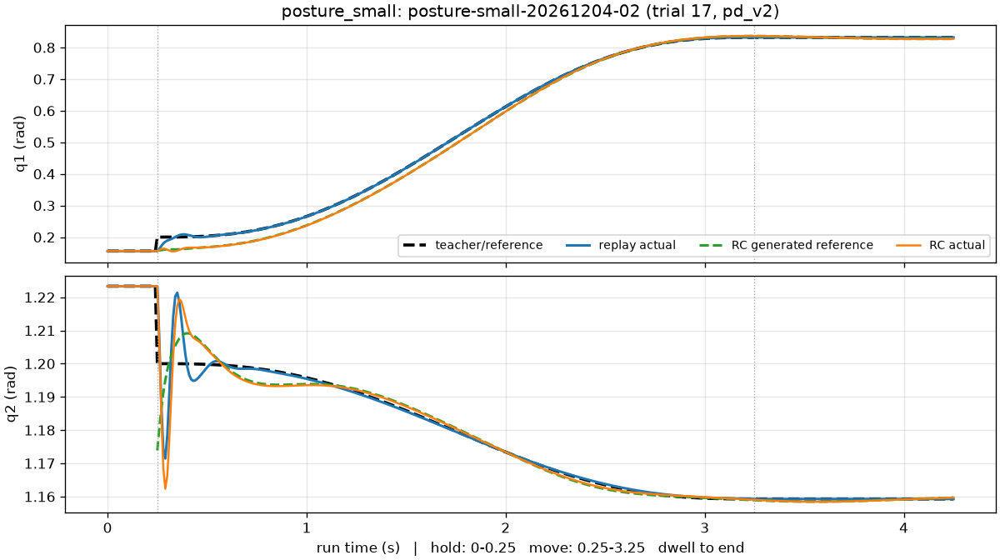
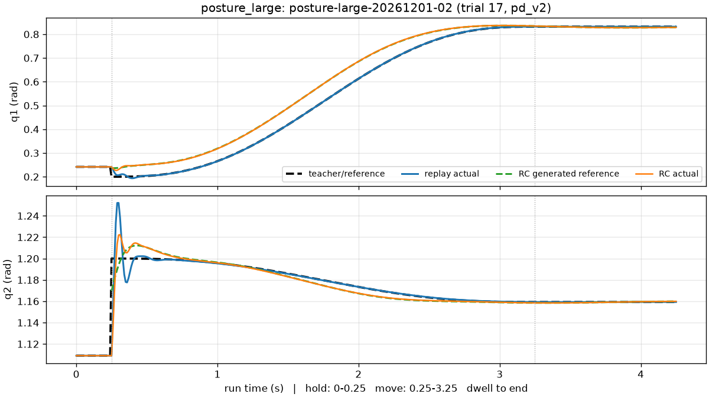
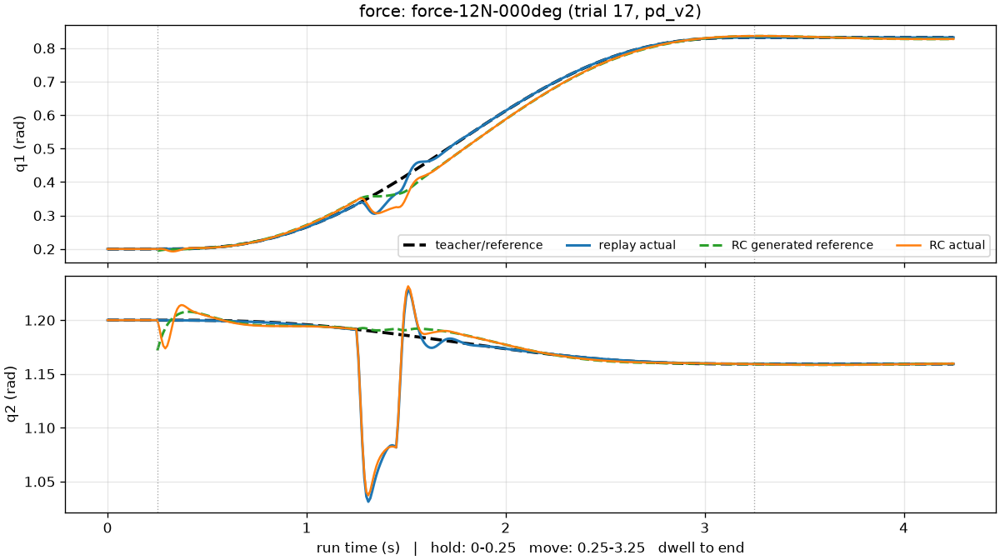
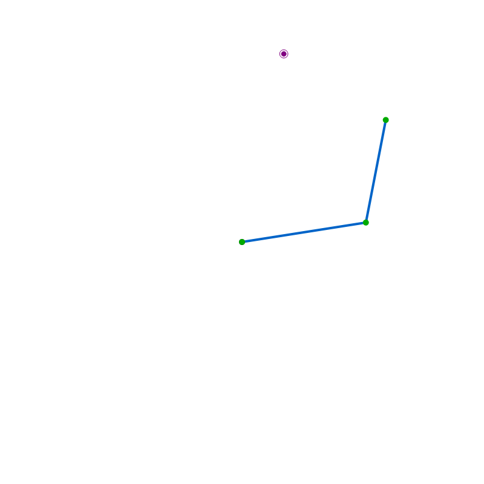
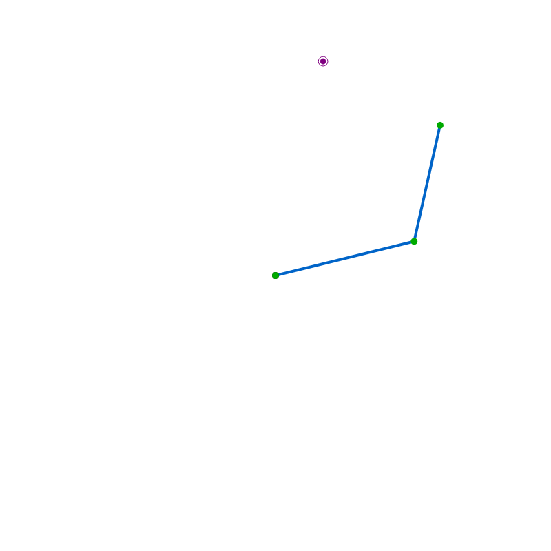

# Task 1-a state-conditioned recovery: development results (v1)

## Summary

- Dataset `processed-20260903-ce343c8ce6a5`; freeze commit `0e15b6270deb`.
- **Accepted negative result.** 134 feasible development trials, 0 eligible under the section 7.3 rule; no model is frozen and the confirmatory suite is not authorized under protocol v1 (`model_freeze_v2`).
- Timing-only arm: 134 of 500 trials feasible, best worst-cell early command-gap ratio 0.6704 (trial 17); no feasible model was found among the sampled trials of the augmented arms, and the residual arm is an exploratory negative (D4).
- Representative pairs below come from the best feasible timing-only trial - a development-representative point, never a selected model.

## Study outcomes

| study | formulation | budget | stored | feasible | best worst-cell gap ratio |
| --- | --- | --- | --- | --- | --- |
| recovery-search-1a-contractive-v1 | contractive | 500 | 500 | 0 | n/a |
| recovery-search-1a-no-augmentation-v1 | no_augmentation | 500 | 500 | 134 | 0.6704 |
| recovery-search-1a-non-decaying-v1 | non_decaying | 500 | 500 | 0 | n/a |
| recovery-search-1a-residual-v1 | residual | 500 | 500 | 0 | n/a |

Full per-trial reports live in the external store behind the committed content-addressed
pointers; the development ablation (`development_ablation_v2`) carries the failure
taxonomies, sampled-coverage figures, and the eligibility evaluation this report renders.

## Paired distributions (early gaps and activation jumps)

Per class-by-tracker cell over all 134 feasible trials: the early command-gap ratio medians and the activation-jump ratio medians (both against paired replay baselines; values below 1 improve on replay). Small-posture cells miss the 15-of-20 consistency requirement, which is what blocks eligibility.

## Representative pairs (convergence, dwell, effort, smoothness)

Selection: Per posture class: the development scenario whose stored pd_v2 early command-gap ratio of the source trial lies closest to the class median (ties by scenario ID); the nominal scenario and the first force scenario by ID complete the set. Deterministic; never picks flattering examples.

These tables cover the curated representative pairs only; the distribution plots and the eligibility evaluation cover all feasible development trials.

### Paired early metrics and target dwell

| class | scenario | tracker | RC run | replay run | jump (rad) | early gap (rad s) | settling (s) | dwell frac | desired vmax (rad/s) |
| --- | --- | --- | --- | --- | --- | --- | --- | --- | --- |
| nominal | nominal | pd_v2 | run-20260904-27f7ccb98e4f | run-20260904-9c32cf3d8fba | 0.02875 | 0.001935 | 0 | 1 | 0.0172 |
| nominal | nominal | computed_torque | run-20260904-a77deb2cda71 | run-20260904-83f433d2ffdf | 0.02875 | 0.00138 | 0 | 1 | 0.0151 |
| posture_small | posture-small-20261204-02 | pd_v2 | run-20260904-449a5c19f80a | run-20260904-c8c77a5bc624 | 0.04942 | 0.00276 | 0.01 | 1 | 0.0173 |
| posture_small | posture-small-20261204-02 | computed_torque | run-20260904-1c2b3d7fae9c | run-20260904-dd2f51194b0c | 0.04942 | 0.001679 | 0.01 | 1 | 0.0153 |
| posture_large | posture-large-20261201-02 | pd_v2 | run-20260904-d9c6c77c5564 | run-20260904-866853da673d | 0.0609 | 0.002566 | 2.14 | 1 | 0.0169 |
| posture_large | posture-large-20261201-02 | computed_torque | run-20260904-c42620144fcc | run-20260904-08994fcffcd0 | 0.0609 | 0.003281 | 2.15 | 1 | 0.0149 |
| force | force-12N-000deg | pd_v2 | run-20260904-14646a0ce72e | run-20260904-34dd8feced9e | 0.02875 | 0.001935 | 0 | 1 | 0.017 |
| force | force-12N-000deg | computed_torque | run-20260904-b319c0e0b6be | run-20260904-6a6e61d824c1 | 0.02875 | 0.00138 | 1.83 | 1 | 0.0149 |

### Original-trajectory RMSE, restoring alignment, and contraction

| class | tracker | RC move RMSE (rad) | replay move RMSE (rad) | mean cosine | positive frac | ref deviation early (rad s) | contraction rate (1/s) |
| --- | --- | --- | --- | --- | --- | --- | --- |
| nominal | pd_v2 | 0.01145 | 0.000254 | 0.452 | 0.733 | 0.002456 | n/a |
| nominal | computed_torque | 0.01293 | 1.484e-05 | 0.505 | 0.805 | 0.002515 | n/a |
| posture_small | pd_v2 | 0.01623 | 0.004087 | 0.51 | 0.8 | 0.01829 | n/a |
| posture_small | computed_torque | 0.01448 | 0.005034 | 0.366 | 0.805 | 0.01806 | n/a |
| posture_large | pd_v2 | 0.03784 | 0.006452 | 0.396 | 0.711 | 0.02309 | -0.24 |
| posture_large | computed_torque | 0.04003 | 0.01102 | 0.403 | 0.768 | 0.02376 | -0.244 |
| force | pd_v2 | 0.02766 | 0.02413 | 0.101 | 0.552 | 0.002456 | n/a |
| force | computed_torque | 0.151 | 0.1417 | -0.0732 | 0.46 | 0.002515 | -1.91 |

### Smoothness and effort

| class | tracker | des accel RMS | act accel RMS | des jerk RMS | act jerk RMS | torque RMS (N m) | torque peak (N m) | saturation |
| --- | --- | --- | --- | --- | --- | --- | --- | --- |
| nominal | pd_v2 | 0.744 | 3.43 | 11 | 218 | 0.1095 | 1.109 | 0 |
| nominal | computed_torque | 0.737 | 2.76 | 10.8 | 101 | 0.2041 | 4.581 | 0 |
| posture_small | pd_v2 | 0.81 | 6.82 | 18.2 | 471 | 0.1443 | 1.479 | 0 |
| posture_small | computed_torque | 0.768 | 4 | 11.2 | 138 | 0.184 | 3.468 | 0 |
| posture_large | pd_v2 | 0.676 | 7.2 | 25.8 | 528 | 0.1787 | 2.421 | 0 |
| posture_large | computed_torque | 0.612 | 2.91 | 5.56 | 55.4 | 0.1305 | 2.449 | 0 |
| force | pd_v2 | 1.09 | 19.1 | 45.9 | 1.77e+03 | 0.9561 | 7.261 | 0 |
| force | computed_torque | 1.77 | 19.3 | 45.9 | 1.52e+03 | 0.8342 | 4.623 | 0 |

## Failures

First failing gate of every infeasible trial, per study:

- `recovery-search-1a-contractive-v1`: anchor scenario 0 [pd_v2]: dwell:dwell_stationary.
    - dwell: 272
    - limit_violation:joint_velocity: 221
    - early_termination: 4
    - generated_dwell: 3
- `recovery-search-1a-no-augmentation-v1`: anchor scenario 23 [pd_v2]: limit_violation:joint_velocity.
    - dwell: 200
    - limit_violation:joint_velocity: 148
    - generated_dwell: 18
- `recovery-search-1a-non-decaying-v1`: anchor scenario 0 [pd_v2]: dwell:dwell_in_tolerance,dwell_stationary.
    - limit_violation:joint_velocity: 258
    - dwell: 229
    - early_termination: 13
- `recovery-search-1a-residual-v1` (exploratory, D4): 0 of 500 feasible; the dominant first failure is the joint-velocity limit (see its study report).

## Limitations

- Synthetic-sample-count confound: the augmented arms train on 1 + N_aug episodes (17-65) against the timing-only arm's single demonstration, so augmentation family and training-set size change together; the matched grids bound but do not remove this confound.
- First-infeasible censoring: an infeasible trial stops at its first failing (scenario, tracker) pair, so the reason taxonomy counts first failures, not all failures a full sweep would find.
- Single scripted demonstration (approved decision D6): results do not establish a basin of attraction outside the augmented training tube, and a negative augmentation result here is valid evidence.
- Development data only: no confirmatory seed, level, or outcome was read, and the section 7.3 gates and their ordering are unchanged; candidate identification here does not select a model (M3R-015 does).
- Flat infeasible objective: every infeasible trial received the identical penalty, so the sampler could not rank failures or learn a direction inside an infeasible region; an all-infeasible study is therefore a sampled search outcome, and graded feasibility-aware objectives are future protocol work, never a v1 change.
- Sampled, not exhaustive: each study evaluated its budget of sampled trials, and the recorded D1 and D1-by-warm-up coverage in the Arms section is incomplete by construction; an all-infeasible arm supports only 'no feasible model was found among the sampled trials', never an exhaustive-grid claim.

## Plots

## Animations

Each animation renders one verified run listed in the representative table above
(`scripts/play_run.py --run <run-id> --scenario configs/tasks/task_1a.toml --export ...`):

